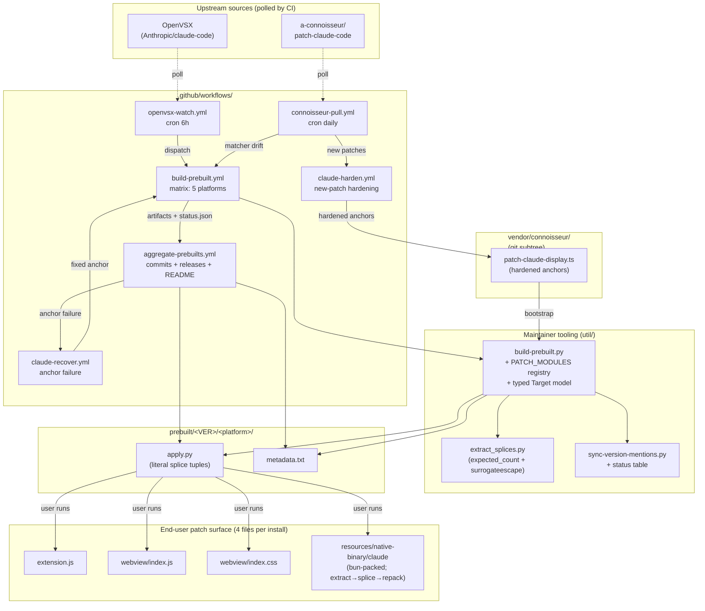

# Plan: extend claude-patches to cover the CLI bundle + absorb connoisseur's patches + OpenVSX-driven CI + Claude-assisted maintenance

## Context

`claude-patches` currently maintains 12 extension-side patches (A–L) for Claude Code at `pfg-v1.7`, packaged as per-version prebuilt `apply.py` scripts with literal `(old, new)` text splices, byte-stability validation (`util/build-prebuilt.py:261-293`), `.bak` discipline, and idempotency via embedded `/*pfg-vX.Y*/` signature (`version.py`). Linux-x64 only; three target files (`extension.js`, `webview/index.js`, `webview/index.css`) per `util/build-prebuilt.py:235`.

This change extends the patchset to a 4th splice target (the bun-packed CLI inside the same extension) while absorbing connoisseur's 11 display patches and standing up auto-maintenance against OpenVSX and the connoisseur upstream.

### What's new vs. v1.7

- **Patch M (subagent UI message drop)**, CLI-side, at `src/tools/AgentTool/agentToolUtils.ts:559-570` of the leaked source. Guard `if (!isLocalAgentTask(t) || !t.retain) return prev` inside the stream-loop's `rootSetAppState` updater drops subagent messages whenever the user isn't viewing that subagent's tab; recovery is gated on `diskLoaded`, which stays true across tab toggles, so dropped messages never come back. Fix: drop `||!t.retain`; rely on existing UUID-dedupe in the bootstrap merge. First patch this repo carries outside `extension.js` / `webview/`.

- **Patch N (preferred CLI-side fix for the thinking-display gap)**, CLI-side. Issue [#59844](https://github.com/anthropics/claude-code/issues/59844) describes two top-level fixes for the showThinkingSummaries-ignored-in-non-interactive-sessions bug: Option 1 (preferred, CLI-side) and Option 2 (fallback, extension-side). Option 1 itself has 4 sub-steps: 1-3 are IDE-side coordination (spawnClaude reads settings, thinking menu persists to settings.json, optional UI control) that Claude.ai owns and we can't patch from claude-patches. **Patch N implements sub-step 4 of Option 1** (the CLI-side gate removal), which is the single change that fixes the non-interactive-session breakage. Sub-steps 1-3 are out of scope; sub-step 4 alone is sufficient for the user-visible bug. In the v2.1.142 build, the anchor is `else if(!T6()&&m6().showThinkingSummaries===!0)K3.display="summarized"` (minified names will drift per release). Fix: drop `!T6()&&` so the branch fires regardless of interactive state. Patch L (existing, shipped in v1.7) is Option 2 and stays as belt-and-braces: if a future bun format change temporarily breaks Patch N, the extension still pushes `--thinking-display summarized` to argv and the CLI's explicit-flag branch (which runs ahead of the showThinkingSummaries gate) keeps things working.

- **CON-A through CON-J** (connoisseur's display tweaks: verbose tool calls, inline thinking, diff colors, subagent prompt visibility, spinner-tip suppression, etc.) **plus Patch O** (our repo-owned welcome marker), all CLI-side. Patch O is the welcome-marker patch (next repo-owned letter after M/N; deliberately NOT named after the existing significant Patch K, the webview-wrap patch advertised in bookends, nor with a CON- prefix). It supersedes connoisseur's `patchWelcomePatchedBadge`, which rebrands `Claude Code` to `Connoisseur's Code` at five distinct sites (see §5 for the enumeration). Patch O scopes DOWN to only the one site that carries a version (the settings `title:` field), appending ` pfg-v{PATCHSET_VERSION}` so the result reads `Claude Code v2.1.149 pfg-v2.0` (version interpolated at synthesis). The other four `Claude Code` rebrand sites stay plain under Patch O; we don't carry connoisseur's broader rebrand. Patch O is a repo-authored splice (`owner="repo"`) that replaces connoisseur's matcher entirely in our PATCH_MODULES registry; we do not run connoisseur's welcome-badge matcher and then patch its output. The repo-owned single-letter ID is load-bearing for recovery routing (see §5).

- **CLI bundle as 4th splice target**: the bun-packed `resources/native-binary/claude` binary inside the vsix. Same `(old, new)` text-splice convention, applied to the extracted JS payload then repacked into the bun envelope.

- **OpenVSX-driven CI** + **Claude-assisted anchor recovery** + **connoisseur subtree pull** for near-zero-touch maintenance after the first ship.

### Why OpenVSX, not npm

The vsix on OpenVSX bundles `extension/extension.js` + `extension/webview/*` + `extension/resources/native-binary/claude` (the bun-packed CLI). The CLI inside the vsix is sha256-equal to the standalone CLI distributed via npm (verified per-version in CI; see §6 build-prebuilt.yml step 6 and §10 metadata.txt). One OpenVSX poll yields lockstep coverage of both surfaces.

## Build status (2026-05-23) — the two riskiest unknowns are spiked GREEN; novel tooling is built

Before committing to the architecture, the two load-bearing unknowns were proven as standalone spikes against the real linux-x64 2.1.150 binary, and the resulting **novel tooling is built, tested, and committed** (it is NOT yet wired into the rest of the repo; that integration is the planned work this document describes):

- **`util/bun_handler.py`** (latest commit `5215ef4`): stdlib-only, surgical-in-place bun-on-ELF extract/repack handler for the linux-x64 ELF `.bun`-section form. Real-binary gates against the 238 MB 2.1.150 binary: byte-exact no-op repack, length-changing grow + shrink that run and show edits, multi-edit remap, determinism, AND **gate 7 (control-flow)**: dropping an operand from a `||` conditional in the entrypoint source changes which branch executes at runtime with the JSC bytecode left bit-for-bit intact. Plus 46 synthetic checks covering malformed-input rejection (crafted `modules_len` overrun raises `BunFormatError`, never lets `struct.error` escape), the unified PT_LOAD invariant gate (any nonzero `.bun` delta refuses if it would break `(p_offset - p_vaddr) mod p_align == 0` for any later PT_LOAD; symmetric on grow + shrink; happy-path aligned deltas proceed), 36-vs-52 fail-closed disambiguation (refuses when both layouts are byte-indistinguishable at record-0 alone), `entry_point_id` hard-fail on name-heuristic disagreement, zero-length-field grow refusal (covers both `(0,0)` tombstones AND `(N>0, 0)` placeholders), and the u32/u64 struct-size variants. **tweakcc is dropped as the writer**: this handler is the single canonical writer at both synthesis and apply, so byte-stability is self-consistency, not cross-tool matching. Side win: tweakcc/node-lief reflow bloats the binary 238→402 MB and isn't byte-identical; the surgical handler produces 238 MB + the exact edit delta. **Linux-x64 ELF only**; Mach-O and PE/COFF are detected and rejected with `NotImplementedError` as future Slice 5 bring-up, NOT inherited from this green status.
- **`util/extract_splices.py`** (commits `4e1b5f8`, `1ae175d`, `17cb280`, `eb89cde`): every splice carries `expected_count` (default 1 = today's find-one/replace-one, existing prebuilts byte-stable); a `WidenCollision` + `_resolve_collision` path collapses identical-context multi-site edits into one `expected_count=K` replace-all (site-independent anchor), and fails closed with a loud collision report on non-uniform sites. A `_verify_splices` self-check simulates the apply and refuses to emit any set that doesn't reproduce the patched file byte-for-byte. Every decode/encode site uses `errors='surrogateescape'` (including the collision-marker encode loop), with a symmetric `apply_splices_to_bytes` contract so arbitrary bytes round-trip exactly. 30/30 standalone checks pass. **At the extractor level only**: wiring `expected_count` + the surrogateescape contract into `build-prebuilt.py`'s `PREBUILT_TEMPLATE` and the generated apply.py is the integration pass, still pending (see Critical files for the `Splice` dataclass + `apply_splices` template requirements).

**Note on rigor**: the test build-out + adversarial code review caught **five** real bugs the happy-path gates missed: a clamped-edge collision-resolution bug in `_resolve_collision` (surfaced by an edge-case nit), a trailer-pad offset bug in `bun_handler` (surfaced while building synthetic fixtures), a missed surrogateescape site in the collision-marker encode loop, a 36-vs-52 disambiguator that silently mis-picked when both layouts were byte-indistinguishable at record-0 alone (no-op self-test still passed), and a zero-length-field grow refusal that only covered `(0,0)` tombstones (missing `(N>0, 0)` placeholders that bun uses for absent fields). All fixed with regression tests verified to fail against the prior code. Lesson recorded for the integration phase: fail-closed branches and edge cases need explicit tests; happy-path gates against the real binary are necessary but not sufficient.

So unknowns #1 (bun determinism) and #3 (literal-splice synthesis) below are **resolved green** for the linux-x64 ELF path, and a third previously-implicit assumption (source control-flow edits actually execute with bytecode intact) is now also **resolved green** with committed real-binary gate 7. The remaining work is integration (consuming this built tooling) plus the still-unproven CI/multi-platform unknowns; Mach-O and PE/COFF are future bring-up, NOT inherited from this green status.

## Load-bearing unknowns (validate before extending)

The plan below specifies a complete architecture. Each slice in the Implementation order falsifies one assumption. If a slice's gate fails, work stops at that slice; the next layer is not built on a broken foundation.

1. **Bun extract/repack determinism** (linux-x64 ELF). **RESOLVED GREEN (2026-05-23 spike → `util/bun_handler.py`)**: stdlib-Python surgical in-place repack is byte-exact and deterministic against the real binary; no content-hash / compression / relocation wall; no tweakcc dependency. Mach-O / PE / pre-2.1.83 overlay form remain unproven and are detected + rejected with `NotImplementedError` (later milestones, re-spike each).
2. **Unified target model** that covers extension files + CLI payloads under one `apply.py` without breaking idempotency. Current model has signature-in-extension.js only; v2.0 needs per-target signatures and a state machine that handles missing-backup, version-mismatch, standalone-only CLI installs, and multi-install loop (a behavior change from v1.7's error-on-multi-install). Falsified by Slice 2.
3. **Literal-splice synthesis from structural patchers**: can connoisseur's TS matchers + Patches M/N's regex passes reliably produce splices the apply step can locate unambiguously? **RESOLVED GREEN (2026-05-23 spike → `util/extract_splices.py` expected_count)**: every current connoisseur matcher (including the multi-site `patchThinkingStreaming`) extracts to unique-1 splices that reproduce connoisseur's output byte-for-byte; the only failure mode (byte-identical context beyond MAX_CONTEXT) is unhit by any current matcher and is now represented by `expected_count=K` (uniform sites) or a loud collision report (non-uniform). The "uses /g ⇒ unrepresentable" fear did not hold.
4. **Race-free CI** discovery + build + publish across 5 platforms. The per-platform matrix racing on `git push main` would deadlock; the aggregator pattern solves this in theory. Falsified by Slice 4.
5. **Connoisseur patches survive being treated as synthesis-time-only inputs**, including under Phase 0 hardening. If hardened matchers fail in subtle ways (e.g., regex over-matches some sites, AST shape isn't actually stable across releases), the synthesis breaks silently. Falsified by Slice 3 plus the downstream gates (tsc syntax check, byte-stability validation, smoke test) catching matcher failures before publication.
6. **Existing patches A–L can be applied at synthesis time without a human in the loop.** Today the maintainer applies A–L by hand (or via a previous prebuilt) before running `build-prebuilt.py`. For CI to be zero-touch, A–L must become synthesis-time PATCH_MODULES too, so a fresh vsix can be bootstrapped from pristine to fully-patched programmatically. **Partly proven already**: `skill/apply-patch-fg.py` already does regex-based structural application for F.1, F.2, F.3, F-s2, F-s3, G.1, G.2, so F and G are reusable as-is. Slice 0 only needs to derive structural matchers for A, B, C, D, E, H, I, J, K, L (10 patches). Falsified by Slice 0.

## Decisions (confirmed)

- **Patchset version**: bump `pfg-v1.7` to `pfg-v2.0`. Single signature family covers all four surfaces; per-target signature probes (§7).
- **Patches M + N are new CLI-side patches.** M = subagent UI message drop. N = #59844 Option 1 (drop `!getIsNonInteractiveSession()` from the showThinkingSummaries branch). Patch L stays as the existing `--thinking-display` extension.js splice (Option 2), retained as belt-and-braces for N. CON-A through CON-J are connoisseur's display tweaks (all CLI-side); O is our repo-owned welcome-badge patch (CLI-side) that supersedes connoisseur's CON-K.
- **Patch O (welcome marker)**: appends ` pfg-v{PATCHSET_VERSION}` to the SINGLE version-bearing site in the bundle (the settings `title:` carrying `` `Claude Code v${...VERSION}` ``), producing `Claude Code v2.1.149 pfg-v2.0`. The other four `Claude Code` rebrand sites connoisseur's `patchWelcomePatchedBadge` would touch (bold `createElement`, `Welcome to Claude Code for`, two `colorFn` forms) stay plain under Patch O; we don't carry the broader rebrand. Interpolated at synthesis time. Repo-authored (`owner="repo"`), supersedes connoisseur's matcher entirely; see §5 for the per-site enumeration and the naming rationale.
- **Platforms (OpenVSX names)**: `linux-x64`, `linux-arm64`, `darwin-arm64`, `win32-x64`, `win32-arm64`. These are the exact platform identifiers OpenVSX uses in its `downloads` map; using anything else (`macos-arm64`, `windows-x64`) breaks the lookup. OpenVSX also exposes `darwin-x64` (Intel Mac), `alpine-x64`, and `alpine-arm64`; explicitly out of scope for v2.0. Document the exclusion in the README: "if you need darwin-x64 or alpine-*, open an issue." No proactive support; demand-driven.
- **No binaries hosted**: repo contains `apply.py` text-splice scripts only. Patches apply in place on the user's already-installed CLI binary.
- **Bun handler**: stdlib-only Python embedded in `apply.py`. Connoisseur's `scripts/vendored-elf-native.ts` is the reference for Linux ELF; extended for Mach-O and PE/COFF envelopes.
- **Connoisseur subtree** under `vendor/connoisseur/` via `git subtree add … --squash` against `a-connoisseur/patch-claude-code main`. No fork. Subtree keeps a complete local copy of the current upstream tree (note: `--squash` squashes commits into single import commits, so full commit history is not preserved; the file content is). Ad-hoc upstream contributions can be made by creating a fork on demand and using `git subtree push`/`git subtree split`.
- **Auto-merge policy**: synthesis + smoke tests on linux-x64 must pass; failures open `gh issue create --label needs-human-review`. No silent ship-broken.
- **Phase 0 hardening**: Claude rewrites connoisseur's 11 anchors to structural matchers before first ship (one-time, maintainer-invoked).
- **Claude inference in CI**: foundational, via `CLAUDE_CODE_OAUTH_TOKEN` GitHub secret.
- **Delivery shape**: solo project, 0 PRs. Work lands as direct commits to `main` in a sequence of conceptual slices (see Implementation order). The slice gates still apply as commit-time checkpoints: don't commit Slice N+1 until Slice N's gate passes locally.

## Shape of the change



## Architecture

### 1. CLI bundle as a 4th splice target

`util/build-prebuilt.py:235` defines `targets` as three direct file paths (tuples of `(relpath, fullpath)`). v2.0 replaces this with a **typed Target model** split across two lifecycles:

**Build-time** (`util/build-prebuilt.py`, never shipped to end users):

```python
@dataclass(frozen=True)
class TargetSpec:
    token: Literal["ext", "wjs", "wcss", "cli"]   # logical id; patch-module eligibility keys on this
    relpath: str          # display/metadata key, e.g. "resources/native-binary/claude"
    source_path: str      # maintainer-machine absolute path; never serialized to prebuilt
    kind: Literal["text", "bun_js"]
    signature: str        # per-target signature, e.g. "/*pfg-v2.0:cli*/"
    patch_ids: tuple[str, ...]  # INTENT: patches we plan to try against this target
```

**Prebuilt-time** (inlined into synthesized `apply.py`, seen by end users):

```python
@dataclass(frozen=True)
class TargetPayload:
    token: str            # "ext" | "wjs" | "wcss" | "cli"
    relpath: str
    kind: str             # "text" or "bun_js"
    signature: str
    source_sha256: str    # sha256 of pre-patch bytes CI fed into PATCH_MODULES (the .bak)
    patched_sha256: str   # sha256 of post-splice+post-signature bytes CI produced
    splices: tuple[Splice, ...]   # OUTCOME: patches that actually produced byte changes
```

The split matters because `source_path` is maintainer-machine state and shouldn't exist in a published artifact; `splices` are synthesis output and don't exist as TargetSpec input. **`patch_ids` on the published payload is derived from `splices`** (`{s.patch_id for s in target.splices}`), never authored directly: a patch that finds no anchor on a given version produces no splice, and we want metadata to reflect what actually applied, not what was attempted.

Dispatch is now explicit (`kind == "text"` reads/splices/writes the file directly; `kind == "bun_js"` extracts JS from a bun binary, splices, repacks). No string-suffix sentinels, no relpath-as-behavior-switch. Adding a new target type (`bun_wasm`, `electron_asar`, ...) is a new enum member, not a new parsing rule. The four v2.0 TargetSpecs:

Each PATCH_MODULE declares its `eligible_targets` (logical tokens; see §5); `TargetSpec.patch_ids` is **derived** by filtering the registry for modules whose `eligible_targets` includes this target's `token`, not hand-authored. The table below shows the resulting assignment (M and N have `eligible_targets == ("cli",)`, so they appear only on the CLI target, never on `extension.js`):

| relpath | kind | signature | patch_ids (derived from each module's declared target) |
|---|---|---|---|
| `extension.js` | text (token `ext`) | `/*pfg-v2.0:ext*/` | the A-L subset with `"ext"` in `eligible_targets` (includes L, the `--thinking-display` Option-2 splice). NOT M or N (both `("cli",)`). |
| `webview/index.js` | text (token `wjs`) | `/*pfg-v2.0:wjs*/` | the A-L subset with `"wjs"` in `eligible_targets` |
| `webview/index.css` | text (token `wcss`) | `/*pfg-v2.0:wcss*/` | the A-L subset with `"wcss"` in `eligible_targets` (currently 1) |
| `resources/native-binary/claude[.exe]` | bun_js (token `cli`) | `/*pfg-v2.0:cli*/` | M, N, CON-A through CON-J, O (all `("cli",)`) |

The CLI relpath is platform-variant: PREBUILT_TEMPLATE emits the right one based on `{platform}` (`claude` on linux-*/darwin-arm64, `claude.exe` on win32-x64/win32-arm64). `util/extract_splices.py` was extended for v2.0 with `expected_count` emission (multi-site replace-all support) and `errors='surrogateescape'` on every decode/encode site so arbitrary bytes round-trip exactly through extract + apply. The CLI's extracted JS is ASCII-clean today, but the surrogateescape contract is the load-bearing rule for any future bundle that contains a non-UTF-8 byte in a patched region.

**End-user runtime loop** in synthesized apply.py:

```python
for target in TARGETS:
    pre_bytes = load_target_bytes(target)        # raw read OR bun-extracted JS bytes
    on_expected_source = (sha256(pre_bytes) == target.source_sha256)
    material = pre_bytes.decode("utf-8", errors="surrogateescape")
    material = apply_splices(material, target.splices)
    material = ensure_signature(material, target.signature)  # idempotent prefix-prepend
    post_bytes = material.encode("utf-8", errors="surrogateescape")
    if on_expected_source and sha256(post_bytes) != target.patched_sha256:
        raise SpliceCompletenessError(target.relpath)   # F-6 bundle-hash gate
    write_target_bytes(target, post_bytes)       # text write OR bun_js repack + atomic rename
```

**Signature stamping model (single coherent definition; supersedes any earlier contradicting wording)**: the per-target signature is NOT a splice (splices are patch transforms produced by PATCH_MODULES). It's a separate prefix-prepend step that runs at BOTH synthesis time and apply time, idempotently:

```python
def ensure_signature(material, sig):
    m = re.search(r'/\*pfg-v[\d.]+(?::[a-z]+)?\*/', material[:1024])
    if m is None:
        return sig + "\n" + material          # unsigned: prepend current sig
    if m.group(0) == sig:
        return material                        # already signed with exactly our current sig: no-op
    # A DIFFERENT pfg signature is present (stale version, or someone else's stamp).
    # Do NOT silently keep it. This shouldn't happen post-restore (the state machine
    # restores from pristine .bak before re-applying), so reaching here is a bug or
    # tampering: raise so the caller routes to the version-mismatch / error path.
    raise SignatureMismatch(f"found {m.group(0)!r}, expected {sig!r}; refusing to silently keep stale signature")
```

The three-way logic matters: skipping on *any* pfg signature (the earlier draft) would let a stale-version stamp survive on freshly-patched material, mislabeling the bundle. By apply time the per-target state machine has already restored from pristine `.bak` for version-mismatch cases, so a different signature here is unexpected; raising surfaces it rather than papering over.

Why apply.py must run it: the byte-stability gate validates that apply.py reproduces the live patched bundle EXACTLY, and the live patched bundle carries the signature. If apply.py applied only splices and skipped signature stamping, its output would lack the signature and byte-stability would fail. So `ensure_signature` is part of the apply.py runtime loop, not just synthesis. The `BuildError`-on-collision guard described later is the synthesis-time variant (synthesis runs from pristine, so a pre-existing signature is an error); apply-time uses the idempotent skip-if-present form above (apply.py may legitimately re-run against an already-signed file).

`load_target` / `write_target` dispatch on `target.kind`; the rest of the loop is uniform.

**Bun handler is maintained as a source file, inlined into apply.py at synthesis time as raw Python code.** Source-side: `util/bun_handler.py` is a normal Python file (read/edit ergonomics preserved). Synthesis-side: `build-prebuilt.py` reads `util/bun_handler.py` at synthesis time and splices its contents directly into the synthesized `apply.py` at a sentinel comment location.

**Two-stage synthesis (ordering is load-bearing)**: PREBUILT_TEMPLATE is processed in TWO passes, in this order:
1. **`.format(version=..., signature_unsuffixed=..., targets_repr=..., platform=..., patchset_version=..., ...)`** first, resolving all `{placeholder}` slots using the existing already-doubled-brace convention (`{{` and `}}` in the template survive as literal `{` and `}`). The sentinel line `# __BUN_HANDLER_INLINE__` contains no braces so it survives `.format()` untouched. See Critical files entry for PREBUILT_TEMPLATE for the full placeholder enumeration.
2. **`template_after_format.replace("# __BUN_HANDLER_INLINE__\n", bun_handler_source + "\n")`** second, splicing the bun handler source in as raw Python. The handler source can contain `{`, `}`, `"""`, `'''`, f-strings, dict/set literals, anything; `str.replace()` doesn't reinterpret them.

Order matters: if `.replace()` ran first, any `{` `}` in `bun_handler.py` (e.g., dict literals, f-string expressions) would get re-interpreted by the subsequent `.format()` as a placeholder and raise `KeyError`. Don't swap the order. **CI lint**: a synthesis test must include a `bun_handler.py` that contains a literal `{` `}` (e.g., `{"foo": "bar"}`) and verify the synthesized apply.py is well-formed Python (`py_compile`).

The result: synthesized `apply.py` is a single coherent Python file with bun handler code inline at module scope. Functions defined in the inlined region are callable from the rest of apply.py directly. End-user apply.py is **self-contained**: curl-pipe (`curl ... apply.py | python3`) works because there's no sibling-file import; single-file release upload works; no signature-coordination concerns between two files.

Cost: each synthesized `apply.py` grows by the size of the handler. The **built** linux-x64 handler (`util/bun_handler.py`, latest commit `5215ef4`) is well under 1000 LOC after all hardening, comparable in size to connoisseur's LIEF-backed `vendored-elf-native.ts` (~930 LOC) but pure stdlib with no external dependencies. The earlier ~1500-2500 LOC estimate was for all three envelopes and was pessimistic. Mach-O / PE would add to that as later milestones. That's acceptable for the curl-pipe-works property; apply.py is read by the user once and run; size doesn't matter past "fits on disk."

**Auditability tradeoff (honest)**: the inlined region carries clear delimiter comment blocks (`# ==== BEGIN BUN HANDLER (from util/bun_handler.py) ====` and matching end marker) so a reviewer reading the synthesized apply.py can skip past it. But a synthesized `apply.py` is genuinely bulky once handler + TARGETS are in place; a `head -200` spot-check won't see the bun handler OR the TARGETS list (with its nested splices). The application logic at the top is reviewable; the bun handler is delimited but bulky; the TARGETS data (each TargetPayload with its nested splices) is at the bottom. The canonical security-review path for an end user evaluating "what does this script do to my machine?" is: read `util/bun_handler.py` in the source repo (well-formatted, syntax-highlighted, focused stdlib Python with no external dependencies) plus `util/patch_modules/*.py` (one file per repo-owned patch) plus `vendor/connoisseur/patch-claude-display.ts` (upstream patcher), not the synthesized monolith. The synthesized form exists for distribution + curl-pipe; the source repo exists for review.

The handler is platform-agnostic in shape: dispatches on the binary's header magic bytes at runtime, so the same `bun_handler.py` source is inlined into every platform's `apply.py`. CI's `build-prebuilt.yml` does the inline step (read source + splice into PREBUILT_TEMPLATE via sentinel replacement) once per (version, platform) build.

**Byte-stability guarantee**: the bun repack is deterministic by construction (no timestamps, no random padding, footer offsets recomputed from payload length only). Proven against the real 238 MB 2.1.150 binary by `bun_handler` gate 1 (byte-exact no-op repack) and gate 3 (determinism: 3× repack produces sha-identical output). The existing `build-prebuilt.py` byte-stability check (`util/build-prebuilt.py:261-293`) consumes the same handler at synthesis time: the synthesized apply.py must reproduce the live patched CLI binary exactly. This is the load-bearing gate, and it now stands on committed evidence rather than a deferred future check.

**Defense-in-depth: post-repack round-trip extract** (end-user apply.py only; not CI, which has the byte-stability gate). After the bun handler repacks the spliced JS into a sibling `.new` file, it immediately re-extracts the JS from the `.new` file and byte-compares against the spliced JS it just wrote. If the round-trip matches, only then does apply.py proceed to the rename step (atomic `os.rename` on Linux/macOS; the two-rename pattern on Windows). If the round-trip fails, the `.new` file is deleted and the user's original binary is untouched. Explicit ordering: extract → splice → repack to `.new` → round-trip extract from `.new` → on success, rename(s) → done. On Windows, the round-trip happens on `claude.exe.new` before either rename runs; the original `claude.exe` only moves out of the way after the new bytes have proven extractable.

This catches: subtle envelope bugs that pass `claude --version` because the loader is permissive; user-machine bun-format mismatches we didn't anticipate; bit-flips during file I/O; cosmic rays. Cost is one extra extract per patch (~ms). The byte-stability gate in CI proves "our repack of *this* binary on *this* runner is deterministic"; the round-trip on the user's machine proves "our repack of *their* binary right now is faithful."

**Apply-time bundle-hash check (F-6 gate, load-bearing pair with `Splice.expected_count`)**: the TargetPayload carries `source_sha256` (sha of the pre-patch bytes CI fed into PATCH_MODULES) and `patched_sha256` (sha of the post-splice + post-signature bytes CI produced). apply.py computes the pre-patch sha of the bytes it just read; if it matches `source_sha256` the user is on the exact bundle CI tested, AND the post-splice + post-signature bytes MUST equal `patched_sha256` byte-for-byte. If the pre-patch sha differs (different micro-version, locale, partial update, etc.), skip the post check. The per-target version-and-platform refusal at §7 handles the broader mismatch case; this bundle-hash gate is the narrow "all splices landed as intended" check for the on-spec case. Without this gate, the round-trip extract above validates only the bun envelope (or file-write integrity for text targets), NOT splice completeness; an `expected_count`-loss in the Splice template (the F-1 risk) would let a CON-* multi-site edit silently under-apply 1 of K sites in the field, and no apply-time check would catch it. Together, `expected_count` (per-splice counted-replace + count gate) and `patched_sha256` (total bundle integrity check after all splices and signature stamping) cover the two distinct under-application paths.

### 2. Connoisseur subtree

```
git subtree add --prefix=vendor/connoisseur \
    https://github.com/a-connoisseur/patch-claude-code main --squash
```

Periodic refresh (driven by `connoisseur-pull.yml`, §6):

```
git subtree pull --prefix=vendor/connoisseur \
    https://github.com/a-connoisseur/patch-claude-code main --squash
```

`--squash` keeps a complete local copy of the upstream *tree* but represents each upstream pull as a single squashed import commit, so individual upstream commit history is not preserved locally. Reproducibility of our synthesis depends only on the tree state at each pull, not on commit ancestry, so squashing is safe. If we ever want full upstream history (for forensic comparison or contributing back individual changes), we can re-add the subtree without `--squash`.

Local edits (hardened anchors, Patch O welcome-badge rebrand, future tweaks) are normal commits on `main`. Subtree-pull merges *can* conflict with our local edits, exactly the same way any merge can conflict; the "subtrees don't fight pulls" framing is wrong if our local edits and upstream's new edits touch the same lines. When conflict happens, the subtree pull leaves the workspace in a partially-merged state and `connoisseur-pull.yml`'s Job 2 surfaces it as `needs-human-review` rather than auto-resolving. Frequency: rare in practice because connoisseur's repo evolves slowly and our local edits concentrate on anchor hardening (orthogonal to most upstream changes), but real and explicitly handled.

### 3. Phase 0: pre-harden connoisseur's anchors (one-time, Claude-assisted)

Before the first synthesis *that includes connoisseur's patches* (Slice 3 onward; Slices 1-2 don't use them yet), Claude rewrites each of the 11 matchers in `vendor/connoisseur/patch-claude-display.ts` to anchor on structural features instead of minified labels:

- Replace `case"<literal>"` matchers with anchors on the `createElement` call's prop shape (e.g., props containing both `searchTerms` and `readOnly`).
- Replace literal phrase anchors (e.g., `"switched from npm to native installer"`) with attribute-based anchors where feasible.
- For multi-site patches (CON-F thinking-streaming), anchor each site on its unique distinguishing feature.
- Keep the original matcher as a fallback so the patcher tries hardened-first, original-second.

**Single-pass per event** (Phase 0 + claude-recover.yml + claude-harden.yml all use the same shape): one Claude invocation produces a full rewrite of the relevant file (`vendor/connoisseur/patch-claude-display.ts` or the failing PATCH_MODULE). Downstream gates (tsc syntax check, py_compile, synthesis against current bundle, byte-stability validation, smoke) decide whether the rewrite commits. No 2-candidate disagreement check. An earlier draft proposed one for "matcher localization", but its incremental value over the downstream gates is unproven and it adds Claude-call count without bounded benefit; if a future failure pattern shows the gates aren't catching mis-anchored matchers, revisit. The byte-stability gate proves the splice is byte-stable; if it picks the wrong site, the smoke test catches it; if the smoke test passes too, the patch works as intended (different site than originally targeted, but functionally equivalent for our purposes).

Phase 0 total: 1 Claude invocation, one-time, maintainer-invoked.

Goal: reduce anchor breaks from current "1–3 per quarter" baseline; the actual improvement is unknown until the first year of v2.0 runs (don't budget against a number we haven't measured).

Maintainer-invoked in **local mode** (Slice 0 and Phase 0 run before CI workflows exist; see §6's Claude inference scope for the local/CI mode distinction). Same `CLAUDE_CODE_OAUTH_TOKEN` from `claude setup-token`, used directly by a local `claude` CLI invocation rather than via GitHub Actions.

### 4. Patches M + N (new, CLI-side)

Both are bootstrap passes inside `build-prebuilt.py`'s PATCH_MODULES (§5), operating on the extracted CLI JS.

JS identifier note: minified names can contain `$` (bundlers use it). The regexes below use `[A-Za-z_$][A-Za-z0-9_$]*` (abbreviated `<id>` in prose) to capture identifiers, NOT `\w+` which misses `$`.

**Patch M** (subagent UI message drop): regex-locate `isLocalAgentTask\(([A-Za-z_$][A-Za-z0-9_$]*)\)\|\|!\1\.retain\)return ` (backref ties the two minified-variable references to the same capture) in the extracted CLI JS, drop the `||!<v>.retain` clause.

**Anchor freshness check (load-bearing, do this before Slice 1 ships)**: this regex was derived from the leaked v2.1.142 source. On the current 2.1.150 binary, `isLocalAgentTask` no longer appears anywhere in the entrypoint JS (verified), and the closest structurally-similar code is `z.update(H,(t)=>{if(!t.retain)return t;...})`. The `isLocalAgentTask` guard is gone and the surrounding code is restructured, so the regex as written would `anchor-failure` on day one. Before Slice 1's Patch-M wiring ships, the maintainer must (a) re-derive the regex against the current bundle, (b) confirm the underlying suppression bug still exists in the new shape (run the original reproduction: backgrounded subagent task, tab away during streaming, tab back, observe message drop), and (c) update this regex AND the Slice 1 verification step accordingly. If the bug no longer reproduces on the current bundle (Anthropic may have fixed it upstream), Patch M can be retired rather than ported.

**Patch N** (#59844 Option 1, showThinkingSummaries in non-interactive sessions): regex-locate the assignment branch `else if\(!([A-Za-z_$][A-Za-z0-9_$]*)\(\)&&([A-Za-z_$][A-Za-z0-9_$]*)\(\)\.showThinkingSummaries===!0\)([A-Za-z_$][A-Za-z0-9_$]*)\.display="summarized"` in the extracted CLI JS. The function names (minified) drift per release; the stable parts are `.showThinkingSummaries===!0)` and `.display="summarized"`. Drop the `!<T6>()&&` clause so the branch fires regardless of interactive state.

**Bootstrap regex uniqueness contract** (load-bearing, applies to M, N, and any future repo-owned PATCH_MODULE): every bootstrap regex must satisfy `len(re.findall(pattern, content)) == 1` before applying. The 0-match and >1-match cases are handled **differently by context**:

- **>1 matches** (any context): ambiguous anchor, fail with `status=anchor-failure`, surface the multiple match offsets in the failure artifact for `claude-recover.yml`.
- **0 matches at SYNTHESIS time** (CI/maintainer, working from a pristine vsix): behavior depends on the module's `required` flag (see §5). For a **required** patch (M, N, A-L), 0 matches is `status=anchor-failure`, NOT a silent skip: synthesis runs from pristine so there's no "already applied" possibility, 0 matches means the bundle changed shape, the patch must NOT silently vanish from `patches_applied` (that would ship a prebuilt missing a patch the user expects), and `claude-recover.yml` fires. For an **optional** patch (CON-* display tweaks), 0 matches logs + skips and the patch is absent from `patches_applied` (a cosmetic tweak missing on some version shouldn't block the prebuilt). See §10's required-vs-optional invariant.
- **0 matches at APPLY time** (end-user apply.py, against a possibly-already-patched file): legitimately means "already applied" (the splice's `old` text was already replaced by `new`) or the user is on a bundle the prebuilt wasn't built for (caught earlier by the per-target version check). Here, log + skip is correct.

This is a separate gate from `util/extract_splices.py`'s `widen_to_unique`, which only expands the **post-patch** literal-tuple context for end-user `apply.py`; widening cannot resolve a bootstrap regex that matches multiple sites in the source. The PATCH_MODULES `apply(content, ctx)` contract enforces the `count == 1` check uniformly, and `ctx` carries whether this is synthesis-time (0-match fails) or apply-time (0-match skips).

Patches M and N are independent (different sites in different functions); apply order doesn't matter. Both must be applied to the same extracted CLI JS before repack; the PATCH_MODULES registry handles this naturally.

### 5. Patches CON-A through CON-J + Patch O mapping + PATCH_MODULES registry

Connoisseur's hardened TS patcher (post Phase 0) is invoked **only at synthesis time** as a bootstrap subprocess. End-user `apply.py` contains only literal Python `str.replace` tuples, same shape as today, with the usual `.bak` + `count==1` + byte-stability rigor (mirrors the existing splice loop at `util/build-prebuilt.py:155-195`).

> **Do not "clean up" the TS/Python seam.** The deliberate design is: connoisseur's matchers stay in TS and run at synthesis time only; the end-user `apply.py` is pure Python literal tuples. A future maintainer might be tempted to port connoisseur's matchers to Python so everything lives in one language. Don't. Connoisseur's regex-and-AST matchers (especially for the multi-site `patchThinkingStreaming` and the createElement-prop structural anchors from Phase 0) are non-trivial in TS and would be more work to reproduce faithfully in Python than the cross-language seam costs. The seam is contained: TS only runs at synthesis time inside CI; end users see no TS. Treat the seam as load-bearing, not as tech debt.

Per-patch mapping (descriptive labels retained as parentheticals in docs):

| ID | Source function in `patch-claude-display.ts` | Label |
|---|---|---|
| CON-A | `patchCollapsedReadSearch` | tool-call-verbose |
| CON-B | `patchWriteCreateDiffColors` | write-create-diff-colors |
| CON-C | `patchWordDiffLineBackgrounds` | word-diff-line-bg |
| CON-D | `patchThinkingCase` | thinking-inline |
| CON-E | `patchRedactedThinkingSummaries` | redacted-thinking-inline |
| CON-F | `patchThinkingStreaming` | thinking-streaming (multi-site) |
| CON-G | `patchSubagentPromptVisibility` | subagent-prompt |
| CON-H | `patchDisableSpinnerTips` | disable-spinner-tips |
| CON-I | `patchVersionOutput` | version-output |
| CON-J | `patchInstallerMigrationMessage` | installer-label |
| Patch O (welcome marker; supersedes connoisseur's `patchWelcomePatchedBadge`) | repo-authored | append ` pfg-v<patchset-version>` to the SINGLE version-bearing site (settings `title:`); leave the other 4 `Claude Code` rebrand sites unchanged. Connoisseur's broader rebrand to `Connoisseur's Code` is NOT carried. |

> Note: actual function names + count may differ in the connoisseur source; Phase 0's first action is to enumerate and confirm the registry. **The welcome-marker patch is repo-authored, not connoisseur's**: connoisseur's `patchWelcomePatchedBadge` rebrands `Claude Code` to `Connoisseur's Code` at five distinct sites via `/g` regexes against the bundle: (i) a bold `createElement(...,{bold:!0},"Claude Code")` form (~2 hits in 2.1.150), (ii) a settings `title:` carrying `` `Claude Code v${...VERSION}` `` (1 hit; the ONLY version-bearing site), (iii) the literal `"Welcome to Claude Code for "` (1 hit, with the workspace name rendered after; no version), and (iv) two `colorFn("claude",theme)("Claude Code")` forms (~3 hits combined). Patch O scopes DOWN to just site (ii): we append ` pfg-v<patchset-version>` to the existing `Claude Code v<ext-version>` template literal there, with `PATCHSET_VERSION` interpolated from `version.py` at synthesis time. Sites (i), (iii), (iv) stay plain `Claude Code`; we don't carry connoisseur's broader rebrand to `Connoisseur's Code`. The naming matters: NOT a CON-* id (a `CON-` prefix would mislead, though routing now uses the explicit `owner` field, not the prefix), and NOT "K"-anything (the existing significant Patch K, the webview-wrap patch advertised in bookends, would collide). Patch O carries `owner="repo"` so recovery edits route to `util/patch_modules/`, not `vendor/connoisseur/`.

**PATCH_MODULES registry** (adopted from connoisseur, extended to cover everything): inside `util/build-prebuilt.py`'s bootstrap section, each of A through L (Slice 0 ports) + Patch M + Patch N + CON-A through CON-J (connoisseur display tweaks) + O (repo-authored welcome badge) becomes a module with metadata:

```python
@dataclass(frozen=True)
class PatchModule:
    id: str                          # "M", "CON-A", "O", ...
    description: str
    owner: Literal["repo", "connoisseur"]   # routing: where claude-recover edits on failure
    eligible_targets: tuple[str, ...]        # LOGICAL target tokens, not relpaths: subset of {"ext","wjs","wcss","cli"}
    required: bool                           # eligible target with 0-match at synthesis: True→anchor-failure, False→skip
    apply: Callable                          # apply(content, ctx) → {content, candidates, patched, skipped, reason}
```

`eligible_targets` uses **logical tokens** (`"ext"`, `"wjs"`, `"wcss"`, `"cli"`, matching the signature suffixes) rather than relpaths, so the platform-variant CLI relpath (`claude` vs `claude.exe`) maps to the single token `"cli"` and no module has to enumerate both. Each TargetSpec/TargetPayload carries its logical token; the orchestrator checks `target.token in module.eligible_targets`.

The synthesis loop iterates `(target, module)` pairs with three outcomes per pair:
- **Ineligible** (`target.token not in module.eligible_targets`): NOT ATTEMPTED. The module is never called against this target; this is distinct from "skipped" (which means it was called and found nothing). Keeps M/N (eligible = `("cli",)`) from ever running against `extension.js`.
- **Eligible + required + 0-match at synthesis**: `anchor-failure` (build fails, claude-recover fires).
- **Eligible + optional + 0-match at synthesis**: skipped, but only with an explicit `skipped_reason` the module must return (`"upstreamed"`, meaning the upstream behavior now matches what the patch wanted, or `"not_present_in_this_version"`, meaning the feature the tweak targets doesn't exist on this bundle). A bare silent skip is not allowed; the reason is recorded so a reviewer can tell "deliberately absent" from "anchor quietly broke."

A-L + M/N + O have `owner="repo"` (live in `util/patch_modules/`); CON-A through CON-J have `owner="connoisseur"` (imported from the vendored TS patcher). `required`: M, N, A-L, O are `required=True`; CON-A through CON-J are `required=False`.

**Recovery routing uses the explicit `recovery_owner` field in `status.json`, NOT prefix-matching**: claude-recover.yml routes to `util/patch_modules/patch_<id>.py` if `recovery_owner=="repo"`; `vendor/connoisseur/patch-claude-display.ts` if `recovery_owner=="connoisseur"`; `util/bun_handler.py` + `util/test_bun_handler.py` if `recovery_owner=="format"` (the bun-format recovery dispatch from a `status=format-ambiguity` failure, distinct from patch-anchor recovery; see the `format-ambiguity` entry in §6 step 13's enum). `recovery_owner` is sourced from the failing `PatchModule.owner` for `status=anchor-failure` cases (where a specific patch module's routing applies), and is set directly to `"format"` by the build job for `status=format-ambiguity` (which has no failing patch). **Note the deliberate domain separation**: `PatchModule.owner` is `Literal["repo", "connoisseur"]` (PATCH_MODULES are only ever repo- or connoisseur-owned, never format-owned); `recovery_owner` in status.json widens to `Literal["repo", "connoisseur", "format"]` because format-recovery has no failing patch but still needs to route to the bun_handler allow-list. This replaces the earlier fragile `startswith("CON-")` prefix check (which would have mis-routed O, and would silently mis-route any future repo-owned patch that happened to start with those letters). The `recovery_owner` field is the single source of truth for the dispatch.

**Naming convention (centralized, not per-entry)**: repo-owned patch recovery uses a central naming helper. `repo_patch_module_path("M")` returns `util.patch_modules.patch_m`; the same helper returns the filesystem path for diff allow-listing and syntax checks. CI validates at startup that every `owner=="repo"` patch ID has a corresponding module exporting the expected interface, and that every `owner=="connoisseur"` patch maps to a function in the vendored TS patcher.

### 6. GitHub Actions workflows

#### OpenVSX API usage (load-bearing)

All workflows that touch OpenVSX use these endpoints:

- **Version discovery**: `https://open-vsx.org/api/Anthropic/claude-code/versions?size=5`. The endpoint is paginated; we read only the most-recent page. **Observed API property (verify in Slice 4 prereq, do not treat as a contract)**: the API returns versions newest-first within a page, so `?size=5` gives the five most recent and always contains the latest. This was confirmed by direct curl (returns `2.1.149, 2.1.148, ...` newest-first), but it's an observed behavior, not a documented guarantee. **The semver-sort below makes us robust to it regardless**: even if OpenVSX ever returns the page unsorted, sorting the keys and taking the last still yields the true latest *within the page*. The only thing the newest-first property buys us is the guarantee that the latest version is *in* the first 5; if that ever breaks (a page returning 5 old versions), the watcher would miss new releases. The Slice 4 prereq re-checks this so we'd catch a behavior change. We do NOT need to walk all history (the goal is "find the newest version", not "enumerate every version"). Returns an *object* with a `versions` field whose keys are the version strings. Semver-sort the page's keys and take the last to get `LATEST` (see the jq snippet in `openvsx-watch.yml`). Do *not* trust `/api/Anthropic/claude-code/latest` for canonical newest, and especially do *not* use its `files.download` field for platform selection (it points at a single arbitrary platform artifact, typically `alpine-arm64`).
- **Per-version metadata + platform downloads**: `https://open-vsx.org/api/Anthropic/claude-code/<version>`. Returns the full metadata including a `downloads` object keyed by platform (`linux-x64`, `linux-arm64`, `darwin-arm64`, `win32-x64`, `win32-arm64`, plus extras we ignore). Each entry has the vsix URL.
- **vsix fetch**: from the `downloads[<platform>]` URL, follow redirects (`curl -L`) to the actual CDN.

#### `openvsx-watch.yml`
- Trigger: `cron: "0 */6 * * *"` + `workflow_dispatch`.
- Permissions: `contents: read` + `actions: write` + `issues: read` (`issues: read` is needed for the debounce check in Step 2 below: the watcher queries open issues to skip versions/platforms with active failure tickets).
- Step 1: `curl -s "https://open-vsx.org/api/Anthropic/claude-code/versions?size=5"` returns an *object* with a `versions` field. Extract the newest semver:
  ```sh
  jq -r '.versions | keys | map(select(test("^[0-9]+(\\.[0-9]+)*$"))) | sort_by(split(".") | map(tonumber)) | last'
  ```
  → LATEST. The `select(test("^[0-9]+(\\.[0-9]+)*$"))` filter restricts to strict-numeric versions (one or more dot-separated digit groups, no trailing dot, no suffix) before sorting; `tonumber` on a string like `"149-rc1"` would crash jq, and `"2.1.149."` would parse the trailing empty segment as `0` and sort wrong. Pre-releases or hotfix suffixes (e.g., `2.1.149-rc1`) stay invisible to auto-publish, which is correct: only stable releases should trigger automated synthesis. (The naive `.versions | to_entries[0].key` works only if the API returns sorted order, which is not guaranteed; the semver sort is safer.)
- Step 2: read `.github/enabled-platforms.json` (same source `build-prebuilt.yml`'s matrix uses). Determine which enabled platforms still need a prebuilt for `$LATEST`:
  - For each enabled platform, check `prebuilt/$LATEST/<platform>/apply.py` existence.
  - For each missing prebuilt, check open issues: if any with `needs-human-review` or `needs-rebake` (severity) plus any `failure:*` machine label exists for that `(version, platform)`, mark it as **debounced** (don't dispatch). Only redispatch when the maintainer closes the issue (signal: underlying cause addressed) or manually re-dispatches.
  - **Dispatch shape**: `build-prebuilt.yml` accepts a `version` input (required) and a `platforms_json` input (optional, JSON-array string). The debounce check happens *before* dispatch and the dispatch is suppressed if *all* missing platforms are debounced. If at least one missing platform isn't debounced, dispatch once with `version=$LATEST` and pass the non-debounced platform list via the `platforms_json` input (e.g., `'["linux-x64","darwin-arm64"]'`); build-prebuilt.yml's setup job parses it and filters the matrix. Defaults to the full `ENABLED_PLATFORMS` list when no filter supplied, so manual dispatches behave naturally. **Input name is exactly `platforms_json`** (not `platforms`) to match build-prebuilt.yml's spec at the next subsection.
- Don't dispatch for platforms not in `ENABLED_PLATFORMS` (otherwise the cron would re-dispatch forever for unsupported platforms during Slices 4–5).

#### `build-prebuilt.yml`
- Trigger: `workflow_dispatch` with `version` input (required) and `platforms_json` input (optional; defaults to the full `ENABLED_PLATFORMS` list from `.github/enabled-platforms.json`). The optional filter lets `openvsx-watch.yml` skip platforms with open debounce-failure issues without dropping the whole dispatch. One dispatch per version, one matrix, one aggregator handoff.
- Matrix is gated by `ENABLED_PLATFORMS` (an explicit list of platform identifiers the bun handler supports). Slice 4 ships with `ENABLED_PLATFORMS=["linux-x64"]` only; Slice 5 expands the list as each platform's bun handler lands. The matrix never runs jobs against unsupported platforms; those are either out-of-scope (e.g., `alpine-x64`) or not-yet-implemented.
- Per-platform `runs-on` mapping (GitHub-hosted runners as of late 2025):
  - `linux-x64` → `ubuntu-latest`
  - `linux-arm64` → `ubuntu-24.04-arm` (or `ubuntu-latest-arm` when stable)
  - `darwin-arm64` → `macos-14` (or `macos-latest` once GitHub's default points at Apple Silicon)
  - `win32-x64` → `windows-latest`
  - `win32-arm64` → `windows-11-arm`
- Permissions: `contents: read` only. All side effects (commits, releases, issues, recovery dispatch) are the aggregator's job; build jobs only produce artifacts + `status.json`. This minimizes the blast radius of a malicious or bug-induced CI run.
- Steps:
  1. Checkout (`contents: read`).
  2. Install bun + python3 + **Node ≥23.6** via `actions/setup-node@v4` with `node-version: '23.6.x'` (required for `--experimental-strip-types` to load connoisseur's TS patcher directly; GitHub-hosted runners do NOT ship Node 23 by default, so explicit setup is load-bearing, since without it the synthesis subprocess at step 7 + the syntax gate fall back to whatever the runner has, which is typically Node 20). The `23.6.x` pin avoids minor-version drift; bump only when connoisseur's `engines.node` field changes.
  3. Fetch platform metadata. Pass `$PLATFORM` to jq via `--arg` to avoid shell-quoting hazards: `curl -s "https://open-vsx.org/api/Anthropic/claude-code/$VERSION" | jq -r --arg platform "$PLATFORM" '.downloads[$platform]'` → vsix URL.
  4. Download vsix via `curl -L`; record sha256.
  5. Unzip into mirror of live extension layout.
  6. **CLI-equality verification**: compute sha256 of the bundled CLI. The path is platform-aware (`extension/resources/native-binary/claude` on linux-*/darwin-arm64; `extension/resources/native-binary/claude.exe` on win32-x64/win32-arm64). Fetch the matching standalone CLI from npm via **`npm pack`** (download the tarball, don't install), so the paths below carry the tarball's `package/` prefix (the wrapper `@anthropic-ai/claude-code` is small; the actual binary lives in one of the per-platform optional packages):
     - `linux-x64` → `npm pack @anthropic-ai/claude-code-linux-x64`, file at `package/claude` inside the tarball
     - `linux-arm64` → `npm pack @anthropic-ai/claude-code-linux-arm64`, file at `package/claude`
     - `darwin-arm64` → `npm pack @anthropic-ai/claude-code-darwin-arm64`, file at `package/claude`
     - `win32-x64` → `npm pack @anthropic-ai/claude-code-win32-x64`, file at `package/claude.exe`
     - `win32-arm64` → `npm pack @anthropic-ai/claude-code-win32-arm64`, file at `package/claude.exe`
     (`package/` is correct HERE because these are `npm pack` tarball paths; the `npm root -g` *installed* layout in §7's standalone-CLI discovery has NO `package/` prefix. Two different layouts; don't conflate.)

     (Exact paths verified in Slice 4 step 1 prereq; correct here if `npm pack` shows different layout.) Wrap the npm fetch in a 3-retry exponential-backoff loop (5s, 30s, 90s) before classifying as `cli-equality-unchecked`; a single network blip on npm shouldn't block synthesis. sha256-compare. Record both in artifact metadata. If they diverge, write `status=cli-divergence` to `status.json` and abort synthesis (hard block, no prebuilt; see §11 for why there's no vsix-only fallback). The aggregator opens the `cli-divergence` issue. The "vsix-CLI = standalone-CLI" assumption is gated per-version, not assumed.
  7. Bootstrap orchestrator (**per-patch attributed, per-target nested**): for each PATCH_MODULE in registry order (A-L → M → N → CON-A...CON-J → O), apply against the current bundle state and **diff-record** the result as `Splice(patch_id, old, new, expected_count)` records grouped by target (extract_splices.py runs once per module per target against pre-state/post-state, not just once at the very end). The `expected_count` is emitted by the extractor (default 1, K > 1 for identical-context multi-site collapsed by `_resolve_collision`); the synthesized apply.py uses the symmetric surrogateescape contract from `apply_splices_to_bytes` to read/replace/write target bytes. The accumulated per-patch records get nested under each `TargetPayload.splices` tuple in the synthesized apply.py; the final `TARGETS = [...]` list is the single source of truth for "what gets patched and by which patches." Per-patch attribution enables `--list-patches` to walk `TARGETS` and report `patch_id`s per target, `--dry-run` to report planned changes target-by-target, and metadata.txt to derive `patches_applied` from the actual splices (not from any separately-authored list, which would drift if a patch produces no splice on a version). **Per-target hash emission**: for each target, the orchestrator records `source_sha256` (sha of the pre-patch `.bak` bytes) and `patched_sha256` (sha of the final post-splice + post-signature bytes); these populate the TargetPayload fields that apply.py validates per the F-6 bundle-hash check (see §1 "Apply-time bundle-hash check").
  8. **macOS only (darwin-arm64)**: ad-hoc codesign the patched binary (`codesign -f -s - <bin>`). This must run *before* the byte-stability check because end-user apply.py also patch-then-codesigns. Byte-stability validates the final signed binary, not the pre-sign repack. Determinism of ad-hoc codesign is the explicit Slice 5 step 2 sub-gate (3× sha-compare; pre-sign-byte-compare + `codesign --verify` fallback if non-deterministic). The original "verify in Slice 5 bring-up: same input → same signature bytes" wording was the deferral; that gate now has a defined spec.
  9. **Per-version determinism re-check** (defense against bun-format drift): run `bun_handler.repack_unchanged` 3× on the pristine vsix CLI for *this* version. sha256 all three results; they must equal the original input bytes. This is the same shape as `test_bun_handler.py` gate 1 (no-op byte-identical) + gate 3 (determinism), applied per-version because bun's packer is upstream code Anthropic doesn't own and could regress on any future release. If determinism fails here, set `status=determinism` and stop; Claude can't recover bun-envelope changes. (Slice 1's one-time gate only proves the current binary is deterministic; bun could regress on any new vsix.)
  10. `python3 util/build-prebuilt.py <ext_dir> prebuilt/$VERSION/<platform>`: byte-stability validation gates against the *final* binary state (post-codesign on macOS, post-repack on others). Uses the per-target nested splice records (TargetPayload.splices) emitted in step 7.
  11. Smoke test: run the patched CLI binary by **absolute path** (the one we just patched at `$ext_dir/resources/native-binary/claude[.exe]`, not whatever resolves on `PATH`; a runner-installed or global `claude` would test the wrong copy). On macOS, the smoke test runs **after** Step 8's codesign; without an ad-hoc signature, the patched binary won't execute under Gatekeeper and the smoke test would mis-classify as `smoke` rather than reporting determinism cleanly. Plus `node --check` on extension.js (preserves current behavior at `prebuilt/2.1.148/apply.py:148-150`) and **a new `node --check` on the extracted CLI JS** (v2.0 addition; v1.7 never checked CLI JS because the CLI wasn't a patch target).
  11a. **Record extracted CLI JS sha256 + uploadable JS sample for cross-platform comparison.** Each per-platform build job writes the extracted CLI JS's sha256 into `status.json` and uploads the first 8KB of the JS (sufficient for grep/diff if a divergence is detected). Per-platform jobs do NOT do the cross-platform comparison themselves: the matrix has no ordering, and for first-synthesis of a version there's no published linux-x64 reference. The actual cross-platform-divergence check runs in the aggregator (which sees all platform artifacts; see `aggregate-prebuilts.yml`).
  11b. **Strict-mode real-binary tool gates** (the control-flow proof must not silently degrade on a future bundle bump). Run `CLAUDE_NATIVE_BINARY=<patched_cli_abs_path> CLAUDE_PFG_STRICT_GATES=gate7 python3 util/test_bun_handler.py`. The strict flag promotes a SKIP on the listed gates to a FAIL: gate 7's "anchor not present in this build" outcome no longer exits silently; CI rejects the build until the maintainer either refreshes the anchor in `test_bun_handler.py` (the documented MAINTAINER.md responsibility) or explicitly waives via `CLAUDE_PFG_STRICT_GATES_WAIVE=gate7`. Default behavior with no env var stays skip-permissive for local dev. Without this step, the control-flow proof would silently stop being exercised on the exact Anthropic bundle bump where the underlying assumption is most likely to drift. Failure sets `status=tool-gate-regression`; aggregator opens a `needs-human-review` issue with the gate's diagnostic output attached.
  11c. **Patch-level smoke tests** (broader than gate 7's architectural-assumption check; catches per-patch behavior regressions on each version). Each PATCH_MODULE exports an optional `smoke(binary_path) -> (ok: bool, detail: str)` method. After step 11's binary smoke and 11b's strict-mode tool gates, the CI runner iterates every applied module (from `status.json`'s `patches_applied`) and calls its smoke against the patched CLI binary. Smoke implementations should be lightweight (single CLI subprocess + output match, ideally < 5s) and assert an OBSERVABLE behavior change a user would notice. Examples: Patch M's smoke (once the §4 anchor is re-derived against current bytes) spawns a `--print` subprocess that triggers the subagent code path and asserts no message-drop in the JSONL; Patch N's smoke runs `claude --print` against a settings file with `showThinkingSummaries=true` and asserts thinking blocks appear; CON-I version-output checks that the patched marker shows. CON-* tweaks that aren't CLI-observable (CON-B/C diff colors, CON-H spinner tips, Patch O's settings `title:` site) return `(True, "cosmetic-only, no CLI-observable assertion")` so the iteration is uniform but the gap is logged for a future visual-test framework. Failure of any non-cosmetic smoke sets `status=patch-smoke-failure`. Asymmetry vs gate 7: gate 7 verifies the bytecode-execution-model assumption (one fixed test that catches a future bun runtime change); patch-level smokes verify each PATCH's behavior landed correctly on each version (per-version, per-patch, catches an anchor that matched a structurally-similar but functionally-different site).
  12. Upload as workflow artifact (`if: always()` so failed jobs still upload). Wrap each step in an error trap that writes `status.json` *before* the upload step runs; `if: always()` alone isn't enough because checkout-adjacent setup, OpenVSX fetch, npm fetch, unzip, or tool install can fail before our explicit status-writing logic runs. Pattern: a `trap 'echo "{\"status\":\"infra\",\"failed_step\":\"$STEP\"}" > status.json' ERR` at the top of the run-block, with `STEP=<name>` set before each command. Aggregator treats missing artifact OR `status=infra` as an infrastructure failure (distinct from the synthesis-failure classes). Artifact contents: `apply.py` (self-contained, bun handler embedded), `metadata.txt`, byte-stability report, smoke-test log, `status.json`. Filename: `prebuilt-$VERSION-$PLATFORM.tar`.
  13. **Failure classification only** (build jobs are `contents: read`; they cannot dispatch workflows or open issues). On any failure, write the classification to `status.json` and exit. The aggregator reads `status.json` and routes accordingly. Status enum (used consistently in both producer and consumer):
      - `success`: synthesis completed, artifacts uploaded.
      - `anchor-failure`: matcher returned 0 candidates, matcher returned >1 and `extract_splices.py` widening didn't converge within `MAX_CONTEXT`, or hardened-then-fallback both miss. Aggregator dispatches `claude-recover.yml`.
      - `determinism`: bun extract+repack not bit-stable, byte-stability validation failed. Aggregator opens an issue. Claude can't fix the bun envelope.
      - `format-ambiguity`: `bun_handler` parse refused with `BunFormatError("ambiguous module table layout")` because the bundle's `modules_len` divides both 36 and 52 record-struct sizes and `_disambiguate_module_struct_size` could not pick one confidently from record-0 alone. **Aggregator dispatches `claude-recover.yml` with `owner=format`** (distinct from `repo`/`connoisseur` patch-anchor recovery; the recovery edits `util/bun_handler.py`'s disambiguator + `util/test_bun_handler.py`, NEVER patch modules). The `status.json` payload for this failure carries rich diagnostics so Claude isn't guessing from `BunFormatError` alone: `modules_len`, candidate record counts under each interpretation (e.g. `modules_len / 36` and `modules_len / 52`), `entry_point_id`, the first 2-3 raw module records as hex under both readings, per-layout validation results (name plausibility, enum plausibility, range validity, and a JS-plausibility check on the inferred entrypoint's contents-field decode under each interpretation), and the current `_disambiguate_module_struct_size` source. Recovery prompt instruction: "propose a stronger deterministic discriminator using the diagnostics above, OR keep the fail-closed refusal if confident discrimination is impossible." The prompt MUST explicitly forbid the tweakcc "default to 52 on ambiguity" approach (verified at `connoisseur-patches/scripts/vendored-elf-native.ts:77` and reproduced in the bundled tweakcc dist, which logs `ambiguous module list length, assuming new format`); that is the silent-mis-pick path our refusal explicitly avoids, and copying it would regress the fail-closed posture into a guess. If the diff gate accepts a stronger discriminator, the recovery commit re-dispatches `build-prebuilt.yml` for the originating `(version, platform)` to verify the synthesis now proceeds.
      - `codesign`: macOS `codesign -f -s -` returned non-zero. Aggregator opens an issue. Usually a runner-environment issue.
      - `smoke`: absolute-path `claude --version` returned non-zero or non-version output. The splices applied but the patched binary doesn't run. Aggregator opens an issue.
      - `cli-divergence`: vsix-CLI ≠ standalone-CLI sha256. Aggregator opens an issue.
      - `cli-equality-unchecked`: npm fetch failed or the equality comparison couldn't run (network, registry transient, missing platform package). Aggregator opens an issue; distinct from `cli-divergence` because the check didn't complete rather than failed.
      - `cross-platform-divergence`: extracted CLI JS for a non-baseline platform doesn't sha256-match the linux-x64 baseline's extracted JS for the same extension version. **Set by the aggregator** (the per-platform build job records sha256 in `status.json` and uploads an 8KB JS sample but does not compare, since the matrix has no cross-platform ordering and for first-synthesis there's no published baseline yet). Aggregator opens an issue; the "single JS, multiple envelopes" assumption needs re-evaluation for that platform/version. Patching that platform/version is blocked until resolved.
      - `openvsx-unavailable`: vsix fetch from OpenVSX failed after retries (3-retry exponential backoff, same shape as npm). Distinct from `infra` because the openvsx-watch cron will re-trigger on the next 6h cycle naturally; the issue may carry the optional `transient` refinement label (see the label-taxonomy note, which permits optional labels beyond the two required ones) so the maintainer can tell "will self-resolve" from "needs action."
      - `tool-gate-regression`: `test_bun_handler.py` in strict mode reported a SKIP (or FAIL) on a gate that release synthesis requires to PASS (currently gate 7, control-flow). Distinct from `smoke` (the patched binary doesn't run) and from `determinism` (the repack isn't bit-stable): the patched binary may be fine, but an architectural invariant the gate verifies per-version is no longer being checked, which is a maintainer-attention condition. Aggregator opens an issue tagged `needs-human-review` with the gate's diagnostic output and the test_bun_handler.py anchor reference attached. The maintainer's options are to refresh the anchor or, if the invariant has been independently verified, set `CLAUDE_PFG_STRICT_GATES_WAIVE=gate7` for the next dispatch.
      - `patch-smoke-failure`: a PATCH_MODULE's `smoke(binary_path)` returned False on the patched binary (per §6 step 11c). The patch's anchor matched (so not `anchor-failure`) and the binary runs (so not `smoke`), but the observable behavior the patch is supposed to produce isn't there. Typical cause: the splice landed at a structurally-similar but functionally-different site, or the patch's behavior assumption no longer holds for this version's runtime. Aggregator opens a `needs-human-review` issue naming the patch and its diagnostic output. Recovery is patch-author judgment: re-derive the anchor for the real fix site, retire the patch if upstream now handles the case, or refine the smoke if it was over-restrictive.
      - `infra`: anything else that broke before the synthesis-specific classification logic could run (checkout, tool install, unzip, non-OpenVSX network failures). Set by the error trap above (Step 12). Aggregator opens an issue.

      (Note: `claude-rate-limit` is NOT in this enum. build-prebuilt.yml runs only deterministic synthesis (repo-owned PATCH_MODULES + connoisseur's TS patcher as a subprocess) and never invokes Claude. Claude inference lives in `claude-recover.yml` / `claude-harden.yml`; rate-limit handling is their concern, see below.)

      **`status.json` schema** (the contract between build jobs and the aggregator; required fields):
      ```json
      {
        "status": "anchor-failure",          // the enum value above
        "version": "2.1.149",
        "platform": "linux-x64",
        // present only for status == "anchor-failure":
        "patch_id": "M",                       // which patch failed (aggregator dedupes recovery dispatches by (version, patch_id))
        "recovery_owner": "repo",               // "repo" | "connoisseur" for anchor-failure (from PatchModule.owner); "format" for format-ambiguity. Recovery routing reads THIS, not a prefix heuristic.
        "target_token": "cli",                  // logical target the patch was eligible for
        "target_relpath": "resources/native-binary/claude",
        "match_count": 0,                       // 0 (anchor missing) or >1 (ambiguous); drives the recover prompt
        "excerpt_artifact": "anchor-fail-M.txt" // name of the uploaded bundle-excerpt + match-offsets artifact for the recover prompt
      }
      ```
      The aggregator and `claude-recover.yml` both read this schema; `recovery_owner` + `patch_id` + `excerpt_artifact` are what make recovery routing and dedup deterministic. For non-anchor-failure statuses the patch-specific fields are omitted; `format-ambiguity` carries its own diagnostics payload instead (see the `format-ambiguity` enum entry).
- Concurrency: `group: build-prebuilt-$VERSION-$PLATFORM, cancel-in-progress: false`.

#### `aggregate-prebuilts.yml`
- Trigger: `workflow_run` when `build-prebuilt.yml` completes (any conclusion).
- Why: per-platform matrix jobs racing on `git push main` is the obvious deadlock. Aggregator commits sequentially. It also centralizes side effects: build jobs are read-only producers; this workflow has all the write permissions.
- Permissions: `contents: write` + `issues: write` + `actions: write` (needed to dispatch `claude-recover.yml` on anchor failures).
- Steps:
  1. Checkout.
  2. Download all artifacts from the triggering workflow run, including those uploaded by failed jobs (`if: always()` ensures these exist).
  3. For each artifact, inspect `status.json`'s `status` field (enum matches `build-prebuilt.yml` step 13):
     - `success` → extract `apply.py` + `metadata.txt` into `prebuilt/$VERSION/$PLATFORM/`, commit.
     - `anchor-failure` → dedupe by `(version, patch_id)` before dispatching `claude-recover.yml` with `recovery_owner` copied from the failing `PatchModule.owner` (one of `"repo"` / `"connoisseur"`). Aggregate all platforms' failures for the same `(version, patch_id)` into a single recovery dispatch (the same JS anchor failure typically appears on every platform since the bundle JS is platform-invariant; firing 5 concurrent recoveries for the same matcher is wasteful and produces racing edits). Use linux-x64's failure excerpt as canonical input if multiple platforms reported the same failure.
     - `format-ambiguity` → dispatch `claude-recover.yml` with `recovery_owner="format"` (NOT inherited from any PatchModule; format-recovery has no failing patch). Dedupe by `(version, modules_len)` since the ambiguity is layout-driven, not patch-driven: all platforms reporting the same `modules_len` + matching per-layout validation results aggregate into a single recovery dispatch. The format-recovery edits `util/bun_handler.py`'s disambiguator + `util/test_bun_handler.py`; see §6 step 13's `format-ambiguity` enum entry for the rich-diagnostics payload that drives the prompt and the explicit "don't mimic tweakcc default-to-52" constraint.
     - `determinism` / `codesign` / `smoke` / `cli-divergence` / `cli-equality-unchecked` / `cross-platform-divergence` / `openvsx-unavailable` / `tool-gate-regression` / `patch-smoke-failure` / `infra` → open the appropriate issue with **two labels**: `needs-human-review` (severity, drives notification routing) plus `failure:<status>` (machine-readable classification for filtering, where `<status>` is the literal status string). Only if no open issue with that `(version, platform, status)` triple already exists (debounce; see "watch retry debounce" below).
     - Missing artifact entirely (build job died before even writing `status.json`) → treat as `infra`. Open the same shape of issue.

  **Issue label taxonomy (one scheme, every issue, every workflow).** Every issue opened by any workflow (aggregate-prebuilts, connoisseur-pull, claude-recover, claude-harden) carries TWO REQUIRED labels (and MAY carry optional refinement labels like `transient`):
  - **One severity label**: `needs-rebake` (auto-recoverable; a re-synthesis or recovery dispatch is expected to fix it without human design work, e.g., anchor-failure where claude-recover will try a fix) OR `needs-human-review` (needs a human decision/diagnosis, e.g., determinism, cli-divergence, supply-chain-gate trip, recovery-gate failure). Severity drives notification routing (§12).
  - **One machine label**: `failure:<status>` where `<status>` is the literal status enum string (`failure:anchor-failure`, `failure:determinism`, `failure:claude-rate-limit`, `failure:supply-chain`, etc.). Used for `gh issue list --label` filtering + the watcher's debounce check.

  This is the single taxonomy; the openvsx-watch debounce (Step 2) keys on "any open issue with a severity label + a `failure:*` label for this `(version, platform)`." claude-recover / claude-harden failure paths use the SAME two-label scheme (they don't invent their own), so debounce and dedup work uniformly across producers.
  3a. **Cross-platform JS equality check.** Read each successful artifact's CLI JS sha256 from `status.json` (recorded by build-prebuilt.yml step 11a). For the current `(version, set-of-platforms)` group, the linux-x64 sha256 is the baseline. Compare every non-baseline platform's sha256 against it. If any differs, mark that `(version, platform)` as `cross-platform-divergence`: do NOT commit its `apply.py` to `prebuilt/$VER/$PLATFORM/`, do NOT release-upload, instead open an issue with both 8KB samples attached (from the failing platform AND from linux-x64) for diff inspection. Other platforms in the same version with matching sha256 still proceed normally. If linux-x64 itself fails synthesis, defer the comparison entirely (no baseline to compare against); the issue body notes this state. **Assumption (load-bearing)**: linux-x64 is permanently in `ENABLED_PLATFORMS`. The cross-platform gate hardcodes it as the baseline; removing linux-x64 from `ENABLED_PLATFORMS` would require redesigning the baseline-selection logic (e.g., pick the first alphabetically, or designate baseline via an explicit `.github/baseline-platform.json` file). Document the constraint in `.github/enabled-platforms.json`'s top comment.
  4. Update README status table via extended `util/sync-version-mentions.py` (§9); commit if changed.
  5. For each successful (version, platform): publish the release idempotently. `gh release upload --clobber` requires an existing release, so the create-or-update is two-stage:
     ```sh
     if gh release view "v$VERSION-$PLATFORM" >/dev/null 2>&1; then
       gh release upload "v$VERSION-$PLATFORM" apply.py metadata.txt --clobber
     else
       gh release create "v$VERSION-$PLATFORM" apply.py metadata.txt \
         --title "$VERSION-$PLATFORM" --notes "Auto-synthesized prebuilt"
     fi
     ```
     This is safe on first publish and on every re-run. The view-then-upload pattern has a TOCTOU window (a concurrent run could delete the release between `view` and `upload`); this is closed by the aggregator's concurrency group serializing all aggregator runs, see below.
- Concurrency: `group: aggregate-prebuilts, cancel-in-progress: false`. This is what makes the view-then-upload pattern above safe; without it, the create-or-update logic would have a race.

#### `connoisseur-pull.yml`

Split into two jobs, same pattern as `claude-recover.yml`/`claude-harden.yml`: run synthesis against the freshly-pulled upstream content in a read-only validation job before the commit/dispatch job gets write power. Executing a third-party TS patcher against the bundle while we hold a write-capable `GITHUB_TOKEN` is the supply-chain attack surface we want to remove.

- Trigger: `cron: "0 4 * * *"` + `workflow_dispatch`.

**Job 1: validation (read-only)**. Permissions: `contents: read`. No write token, no Claude token. Steps:

  1. Checkout `main`.
  1a. `actions/setup-node@v4` with `node-version: '23.6.x'` (needed by step 6's synthesis subprocess that runs `node --experimental-strip-types vendor/connoisseur/patch-claude-display.ts`).
  2. Poll: `curl -s https://api.github.com/repos/a-connoisseur/patch-claude-code/commits/main | jq -r .sha`. Compare with sha recorded at last pull (stored in `vendor/connoisseur/.last-subtree-sha`). Exit clean if unchanged.
  3. `git subtree pull --prefix=vendor/connoisseur https://github.com/a-connoisseur/patch-claude-code main --squash` *into the workspace only* (not pushed yet).
  4. Diff PATCH_MODULES registry pre/post pull; classify (a) new patches added, (b) existing matchers changed.
  5. Run **supply-chain gate** on the diff (no token in env, just static checks). Any failure → `human-review-required`:
     - Total lines changed in the subtree diff ≤ 200.
     - No new top-level files added under `vendor/connoisseur/` (a hostile actor's most likely vector is a new file that gets imported elsewhere); new files in subdirs are OK with bigger scrutiny.
     - No new `eval(`, `exec(`, `Function(`, or shell-script files anywhere in the diff.
     - No change to `vendor/connoisseur/package.json`'s `scripts` block or `dependencies` / `devDependencies` (regardless of line count). New deps and lifecycle hooks are too high-blast-radius to auto-merge.
     - No change to `vendor/connoisseur/tsconfig.json` that redirects the compilation entry point or relaxes `--strict`.
     - No new top-level `import` of a package not previously in `dependencies` anywhere in the subtree diff. (A new `import` of an already-vetted package is fine; a new `import` of a freshly-added package wouldn't reach this check because the `dependencies` change above would already trip.)
     - **Inputs-to-Claude content scan**: grep the diff for instruction-pattern markers that would prime an injection in CON-* runs (`ignore previous instructions`, `disregard`, `system:`, `assistant:`, `<system-reminder>`, base64-shaped strings >64 chars inside comments or string literals). Heuristic, not exhaustive; trip → human review.
  5a. Pin the **synthesis subprocess in CI** to a stable invocation: it executes `vendor/connoisseur/patch-claude-display.ts` via `node --experimental-strip-types vendor/connoisseur/patch-claude-display.ts` (Node ≥23.6 strips types at load time; connoisseur's `package.json` already pins this Node version). NOT via `bun run`, `npm run`, `bunx`, `npx`, or any lifecycle-script wrapper. This complements `--ignore-scripts` at install time by ensuring no `scripts` block from a hostile `package.json` could execute even if it slipped past the gate at step 5. Type-checking is a separate step via `node ./node_modules/typescript/bin/tsc --noEmit --strict`; type-check and execute are distinct invocations of distinct binaries.
  6. Run synthesis against current OpenVSX latest using the post-pull `vendor/connoisseur/` content. This is where the connoisseur TS patcher executes; it runs here in the read-only job, with no `GITHUB_TOKEN` write permission, so an injected exfil can't reach our credentials.
  7. Upload as artifacts: the diff, the classification (`new-patches` / `matcher-changes`), the supply-chain gate results, the synthesis output (success or `anchor-failure` excerpts).

**Job 2: commit / dispatch (token-bearing)**. Permissions: `contents: write` + `issues: write` + `actions: write`. No Claude token. Triggered on Job 1 completion (`needs: validation`). Job 1 also publishes the exact upstream commit SHA it validated as a workflow output so Job 2 can rerun the subtree pull deterministically against the same tree. Steps:

  8. Read Job 1's artifacts including the validated upstream SHA.
  9. If supply-chain gate failed or human-review-required is set → open `needs-human-review` with the diff and gate results. Stop.
  10. Fresh checkout of `main`. Rerun `git subtree pull --prefix=vendor/connoisseur https://github.com/a-connoisseur/patch-claude-code <VALIDATED_SHA> --squash` pinning to the exact upstream SHA Job 1 validated. (Without this pin, an upstream race could land new commits between Job 1's pull and Job 2's pull, and Job 2 would commit unvalidated content. Pinning to the SHA Job 1 saw is the load-bearing safety property.)
  11. Commit + push to `main`. Trigger `openvsx-watch.yml` to re-synthesize per-platform with the new vendor content.
  12. If `new-patches` detected → dispatch `claude-harden.yml` for the new patch IDs.
  13. If `matcher-changes` with `anchor-failure` → dispatch `claude-recover.yml` for the broken matchers.
  14. Any other failure → `gh issue create --label needs-human-review` with diff + logs.

#### `claude-recover.yml` / `claude-harden.yml`

Each workflow is **split into two jobs** so the Claude credentials and the write token never co-exist in the same job. **We do not use `anthropics/claude-code-action`** because that action requires `contents: write` + `pull-requests: write` + `issues: write` + `id-token: write` (per its setup docs), with no documented dry-run / diff-only mode. Those required write scopes would force the candidate-generation job to hold GitHub write power, defeating the split-job containment.

**We also do not hand-roll an HTTP client against `api.anthropic.com`.** The reason: `CLAUDE_CODE_OAUTH_TOKEN` (from `claude setup-token`) is a subscription-bound auth token, not an API key, and the public `/v1/messages` endpoint with `x-api-key` won't accept it. Building a raw HTTP client would require reverse-engineering or guessing Anthropic's session-exchange protocol that the `claude` CLI uses internally.

**The actual approach: invoke the `claude` CLI itself in non-interactive mode.** The CLI is the canonical client for `CLAUDE_CODE_OAUTH_TOKEN`-based auth (you already use it locally with this token; it just works). `util/claude_call.py` becomes a thin subprocess wrapper around `claude --print` (one-shot prompt → text response, no interactive UI). We restrict tool-use with **`--tools ""`** (the documented "disable all tools" sentinel per `claude --help`: "Specify the list of available tools from the built-in set. Use \"\" to disable all tools"); this is distinct from `--allowedTools=""` which is an empty *allow-list* with undocumented semantics, so spelling the flag right is load-bearing. The candidate-generation step stays pure prompt → text with no Bash/Read/network capability inside Claude itself.

CI installs the `claude` CLI separately from any bundle being patched. Install the **wrapper** package, not the per-platform binary package: `npm install -g @anthropic-ai/claude-code` (the wrapper at `@anthropic-ai/claude-code` resolves to the right per-platform optional dependency automatically and provides the launcher shim that puts `claude` on PATH; installing `@anthropic-ai/claude-code-linux-x64` directly gives the binary but not the launcher, so `claude` won't resolve). Latest stable; doesn't have to match the version we're patching, just needs to be a working CLI that knows the auth protocol. Chicken-and-egg avoided: claude-recover.yml uses a known-good CLI to fix anchors for any version, including the version that's currently broken in our bundle synthesis.

**Install must NOT use `--ignore-scripts`** (this is the opposite of the connoisseur-pull TypeScript install). The wrapper's `postinstall` is what wires the native binary into the launcher; `--ignore-scripts` would leave a broken `claude` that fails at first invocation. But we also can't run a third-party `postinstall` with `CLAUDE_CODE_OAUTH_TOKEN` in env. Resolve with the same split-job pattern used for the tsc setup: a **tokenless setup job** (`contents: read`, no Claude token) runs `npm install -g @anthropic-ai/claude-code` WITH postinstall, tars the resulting install tree (the global prefix's `lib/node_modules/@anthropic-ai/` + the `bin/claude` shim), and uploads it as an artifact. The **token-bearing candidate-generation job** downloads and extracts that artifact onto PATH, then invokes `claude --print`. The postinstall ran in a token-free environment; the token job only ever runs the already-wired binary. (`@anthropic-ai/claude-code` is Anthropic's own package, so the supply-chain concern is lower than connoisseur's, but keeping the token out of any postinstall is free defense-in-depth and reuses the existing pattern.)

1. **Candidate generation job** (auth: `CLAUDE_CODE_OAUTH_TOKEN`, GitHub permissions: `contents: read` only). Downloads the prepared `claude` CLI artifact from the tokenless setup job (the one that ran `npm install` WITH postinstall, token-free; see the paragraph above) and extracts it onto PATH. Does NOT run `npm install` itself, so no third-party postinstall ever executes with the OAuth token in env. Runs `util/claude_call.py` which shells out to `claude --print --tools "" --output-format=text "<prompt>"`, captures stdout, extracts the unified-diff block, writes `candidate.patch`. Uploaded as workflow artifact. No `GITHUB_TOKEN` write permission; the job cannot commit, push, dispatch, or create issues even if a prompt injection succeeds against Claude. The CLI process inside the job has tool-use disabled by flag, so Claude has no Bash/Read/network capability inside; only path off the runner is the artifact upload.

   **Diff-extraction strategy**: the prompt instructs the model to wrap the unified diff in a ` ```diff ... ``` ` fenced code block. `util/claude_call.py` extracts the first fenced block tagged `diff` or `patch` (regex `r"```+(?:diff|patch)?\s*\n(.*?)```+"` with DOTALL, tolerates 3 or 4 backticks and either language tag, both of which models use interchangeably). If no fenced block is found, the extractor sniffs stdout for unified-diff markers (`^--- `, `^\+\+\+ `, `^@@ `) and only passes through if at least one is present; otherwise it fails fast with "no diff in model response" rather than handing raw prose to `git apply --check` (whose error message in that case is confusing). The validation job's `git apply --check` is the final gate. Alternative considered: `--output-format=json` for structured parsing; rejected because the stable JSON schema for `claude --print` text content isn't documented across CLI versions, while the fenced-block convention is robust enough and language-model-friendly.

2. **Validation + apply job** (no Claude auth, GitHub permissions: `contents: write` + `issues: write` + `actions: write`, the last being needed to dispatch `build-prebuilt.yml` for the synthesis-retry after a successful diff apply). Downloads the artifact, runs the diff gate (allow-list check), syntax gates (`node --experimental-strip-types` for TS / `py_compile` for Python), and synthesis retry. If all gates pass, applies the diff to the working tree, commits, and dispatches `build-prebuilt.yml` for the affected version(s). If any gate fails, opens `needs-human-review`.

This separation means: the Claude caller never holds GitHub write power; the validation/apply caller never holds Claude credentials. The maintainer-controlled validation logic is the only thing that holds write power, and it's deterministic (no prompts).

Job-level prompts (constructed by the workflow, sent to Claude via `util/claude_call.py` → `claude --print`):

- `claude-recover.yml`: "anchor failed: [details]; bundle now looks like [excerpt]; propose hardened anchor per `docs/patches.md`; produce as a unified diff."
- `claude-harden.yml`: "rewrite these new patches' matchers per our structural methodology; produce as a unified diff against `vendor/connoisseur/patch-claude-display.ts`."

**Rate-limit handling (recover/harden only, since these are the only Claude-invoking workflows)**: if `util/claude_call.py` returns a rate-limit error from the `claude` CLI (the maintainer's subscription 5-hour window is drained, possibly by the maintainer's own local use; see the OAUTH rate-limit-collision note in §6), the candidate-generation job exits with `status=claude-rate-limit`. This is distinct from `anchor-failure`: the anchor might be perfectly findable, we just couldn't ask Claude right now. The validation/apply job opens an issue tagged for re-dispatch after the window resets (maintainer re-runs via `gh workflow run`), rather than treating it as a code-side anchor problem. build-prebuilt.yml never emits this status (it doesn't invoke Claude).

**Invariant test (CI lint)**: `util/claude_call.py`'s "no tool-use" property is load-bearing for the security narrative. The lint cannot be a literal substring grep, because the natural Python idiom is `subprocess.run(["claude", "--print", "--tools", "", "--output-format=text", prompt])` where `"--tools"` and `""` are two separate string literals separated by `, ` (no literal substring `--tools ""` exists in correct code). Use a pytest instead: import `util/claude_call.py`, inspect the constructed argv (the module exports a named constant like `CLAUDE_CLI_ARGS = ["claude", "--print", "--tools", "", "--output-format=text"]`), and assert (a) `"--tools"` is in the list, (b) the element immediately after `"--tools"` equals `""`, (c) no element matches `--allowedTools` / `--allowed-tools` / `--disallowedTools` / contains `tools=` / contains `tool_use`. The pytest runs as a CI gate; tripping blocks PR/commit on `main`. Same logic could be a regex grep (`grep -E '"--tools"\s*,\s*""' util/claude_call.py` must hit; `grep -E '--allowedTools|--allowed-tools|--disallowedTools|tools=|tool_use' util/claude_call.py` must fail), but pytest is more robust because it inspects the actual argv used at call site rather than the source-code spelling.
- **Recovery scope routed by `status.json`'s `recovery_owner` field, enforced by post-action diff gate**:
  - `recovery_owner` is set by the build job based on the failure: for `status=anchor-failure` it copies the failing `PatchModule.owner` (one of `"repo"` / `"connoisseur"`); for `status=format-ambiguity` it is set directly to `"format"` (no failing patch). The routing is therefore a status.json lookup, NOT a string heuristic on patch IDs:
    ```python
    recovery_owner = failure["recovery_owner"]   # "repo" | "connoisseur" | "format"
    if recovery_owner not in ("repo", "connoisseur", "format"):
        raise ValueError(
            f"unknown recovery_owner {recovery_owner!r} "
            f"for {failure.get('patch_id', '<format-ambiguity>')!r}")
    ```
    This deliberately replaces the earlier `patch_id.startswith("CON-")` heuristic, which would mis-route **O** (repo-authored welcome marker, no CON- prefix but conceptually replaces connoisseur's CON-K) and any future repo-owned patch. Note the domain separation: `PatchModule.owner` stays `Literal["repo", "connoisseur"]` (patch modules are never format-owned); only `recovery_owner` in status.json widens to include `"format"`.
  - `recovery_owner == "connoisseur"` → allow-list is `vendor/connoisseur/patch-claude-display.ts`.
  - `recovery_owner == "repo"` → allow-list is the filesystem path returned by `repo_patch_file_path(patch_id)` (see helper below).
  - `recovery_owner == "format"` → allow-list is `util/bun_handler.py` + `util/test_bun_handler.py`. Dispatched from `status=format-ambiguity` (NOT `anchor-failure`); see the `format-ambiguity` enum entry in §6 step 13 for the rich-diagnostics payload requirement, the "propose a stronger discriminator OR keep fail-closed" prompt shape, and the explicit "do not mimic tweakcc's default-to-52" constraint.

  **Centralized convention helper** (in `util/patch_modules/__init__.py` or similar; one place, all consumers). Two paired functions so callers don't reverse-engineer one from the other:
  ```python
  import os
  # Repo-owned patch IDs: A-L (Slice 0 ports) + M + N + O (welcome badge). All single letters.
  REPO_PATCH_IDS = set("ABCDEFGHIJKLMNO")

  def repo_patch_module_path(patch_id: str) -> str:
      if patch_id not in REPO_PATCH_IDS:
          raise ValueError(f"{patch_id} is not a repo-owned patch")
      return f"util.patch_modules.patch_{patch_id.lower()}"

  def repo_patch_file_path(patch_id: str) -> str:
      # Returns relative path from repo root. Used for diff allow-listing
      # and syntax-gate target identification.
      return os.path.join("util", "patch_modules", f"patch_{patch_id.lower()}.py")
  ```
  CI asserts every ID in `REPO_PATCH_IDS` has a module at the computed path that exports the PatchModule interface, and that `REPO_PATCH_IDS` exactly equals `{m.id for m in PATCH_MODULES if m.owner == "repo"}` (so the helper's static set can't drift from the registry's owner fields). claude-recover.yml + claude-harden.yml consume the helpers for allow-list construction and import gating.
  - **Enforcement** (split-job model: Claude job has no write token, validation/apply job has the write token and runs the diff gate before committing). The candidate-generation job produces a unified-diff artifact. The validation/apply job verifies:
    1. **Diff artifact exists and is non-empty.** If absent or empty, treat as recovery-failed and open `needs-human-review`. The model may have responded with prose only, or `util/claude_call.py` may have failed to extract a unified-diff block from the response; both cases produce an empty artifact and route here.
    2. **Diff applies cleanly** to the current `main` tree (`git apply --check candidate.patch`). If not, treat as recovery-failed and open `needs-human-review`.
    3. **Every path the diff touches is in the allow-list** for that patch owner. The allow-list (computed from `repo_patch_file_path(patch_id)` or `vendor/connoisseur/patch-claude-display.ts`) is enforced by a small Python script that does exact-path membership rather than shell `grep -vFf`:
    ```python
    # util/diff_gate.py: inspect a unified-diff artifact, exit non-zero if any
    # path touched is outside the allow-list.
    import re, sys
    diff_path, *allowed = sys.argv[1], sys.argv[2:]
    paths = set()
    with open(diff_path) as f:
        for line in f:
            m = re.match(r'^\+\+\+ b/(.+)$', line) or re.match(r'^--- a/(.+)$', line)
            if m: paths.add(m.group(1))
    out_of_scope = paths - set(allowed)
    if out_of_scope:
        sys.exit(f"diff gate: out-of-scope edits: {sorted(out_of_scope)}")
    ```
    Only after all three checks pass does the validation/apply job `git apply candidate.patch && git commit`. If any check fails, the diff artifact is preserved as a workflow artifact and `needs-human-review` is opened with it attached.
  - Caller workflow opens issues on `claude_call.py` exit non-zero, missing/empty artifact, apply-check failure, or diff-gate failure.
- **Single Claude invocation per event** (same shape as Phase 0): one candidate-generation pass producing a diff artifact. The downstream gates (diff allow-list, syntax check, synthesis retry, smoke) are what enforce correctness; multiple candidates would share the same prompt and the same model's blindspots without buying anything the gates don't already catch. Per invocation cost: 1 Claude call.
- **Syntax gate before commit**: split into a *tokenless setup* job and a *tokenful execution* job so upstream package scripts can't run with `CLAUDE_CODE_OAUTH_TOKEN` in env:
  1. **Setup job (no Claude token)**: first run `actions/setup-node@v4` with `node-version: '23.6.x'` (required by the execution job's `node --experimental-strip-types` invocation when synthesis-retry executes connoisseur's TS patcher; setup-node is needed in this job too so the tarballed `node_modules/typescript/` is compatible with the Node major version used downstream). Then install pinned TypeScript via `npm install --no-save --ignore-scripts typescript@<pinned>`. Use `--ignore-scripts` to prevent any package's `postinstall` from running. Tarball `node_modules/typescript/` (the package itself, not just the `.bin/tsc` shim, because the shim is a thin wrapper that requires the package's `lib/` files to be reachable) and upload as a workflow artifact. The shim alone is a JS entry-point that does `require("typescript/lib/tsc")`; uploading just the shim breaks at first invocation.
  2. **Syntax check (token job)**: first run `actions/setup-node@v4` with `node-version: '23.6.x'` in this job too (the setup-job's Node-environment doesn't carry over to a separate job). Download and extract the TypeScript artifact. Invoke `node ./node_modules/typescript/bin/tsc --noEmit --strict vendor/connoisseur/patch-claude-display.ts` for type-checking. **For actual execution** of the TS patcher (e.g., during synthesis), use `node --experimental-strip-types vendor/connoisseur/patch-claude-display.ts` (requires Node ≥23.6, which connoisseur already pins in its `package.json` engines field; that's exactly why setup-node is needed in both jobs). `tsc --noEmit` only type-checks; it doesn't run the file. Do not use `bun run`, `npm run`, `bunx`, `npx`, or any lifecycle-script runner: pinned-binary direct invocations only, so a hostile `scripts` block in a compromised `package.json` cannot execute.

  Per owner:
  - CON-* candidates → the tsc step above.
  - A-N candidates → `python3 -m py_compile <path>` plus a quick import-test (`python3 -c "from <module> import apply"`), where both `<path>` and `<module>` are derived from `repo_patch_module_path(patch_id)` and `repo_patch_file_path(patch_id)`. Python stdlib only; no package install needed in the token job.

  Block the commit if either fails. Without this gate, a hallucinated rewrite that compile-fails would surface downstream as a confusing "synthesis crashed weirdly" rather than the actionable "Claude's anchor fix didn't typecheck", costing a maintainer-attention cycle to diagnose. Failure path: open `needs-human-review` with the tsc/py_compile output attached. (Could optionally re-invoke Claude once with the error appended to the prompt before giving up, but skip-to-human is simpler and the cases that warrant retry are rare.)

#### Claude inference scope (where the OAUTH token is used)

All five sites use `CLAUDE_CODE_OAUTH_TOKEN`, generated once via `claude setup-token` on a trusted machine. Two execution modes:

- **Local maintainer mode** (one-time bootstrap, before CI exists): for Slice 0 (A-L derivation) and Phase 0 (CON-* hardening), the maintainer runs the `claude` CLI locally against the relevant source files. No GitHub workflow needed; the token is used directly by the local `claude` invocation. This avoids the chicken-and-egg problem of needing CI workflows before the CI workflows are written.
- **CI mode** (steady state, from Slice 4 onward): once `.github/workflows/` is wired up, `claude-recover.yml` and `claude-harden.yml` run in GitHub Actions on event triggers, consuming the same `CLAUDE_CODE_OAUTH_TOKEN` from repo secrets via `util/claude_call.py` (subprocess wrapper around `claude --print --tools ""`, **not** `anthropics/claude-code-action`, **not** a raw HTTP API client; see "claude-recover.yml / claude-harden.yml" above for why).

The five sites and which mode each runs in (single-pass per event, downstream gates do the real work):

- **Slice 0** (local, one-time): derives PATCH_MODULES matchers for A–L from the existing v1.7 prebuilt's literal tuples. One whole-file pass = 1 Claude invocation.
- **Phase 0** (local, one-time): hardens the 11 connoisseur matchers in a single whole-file pass. 1 Claude invocation.
- **`claude-recover.yml`** (CI, event-triggered): fires whenever synthesis can't find a unique anchor. 1 invocation per fire.
- **`claude-harden.yml`** (CI, event-triggered): fires on `connoisseur-pull.yml` when new upstream patches are detected. 1 invocation per new patch.
- **Future ad-hoc** (either mode): any new in-house patch development can reuse the local maintainer mode for one-off derivations, or the CI mode via manual `workflow_dispatch` once the workflows exist.

Token setup happens once via `claude setup-token` on the maintainer's trusted machine. The resulting token is added to GitHub repo secrets as `CLAUDE_CODE_OAUTH_TOKEN` and is also the credential used by local-maintainer-mode invocations. One credential path, one rotation surface; no separate maintainer-account credential mode.

#### Claude inference surface

Each Claude invocation receives only the minimum bundle excerpt, patch metadata, matcher source, relevant docs section, and failing diagnostics needed for that recovery/hardening task. Two CI-side credentials are sensitive and must never reach Claude's prompt context:

- `CLAUDE_CODE_OAUTH_TOKEN` (auth passed via env to the `claude --print` subprocess invoked by `util/claude_call.py`; not needed in the prompt).
- The workflow-scoped `GITHUB_TOKEN`. In the candidate-generation job this is `contents: read` only (no write power); in the validation/apply job this has write power, but it's a separate job with no Claude in the loop. Treat the diff gate as the write-control; treat token absence from the prompt as the secret-control.

Everything else (logs, bundle excerpts, install paths, vsix payloads) is non-secret and gated mostly for context economy and to minimize blast radius if a future prompt-injection vector emerges from a compromised upstream input.

Per-site surface, by column: what goes *in* to Claude, what files the candidate-generation step is allowed to *edit*, and what gates validate the *output*. In CI sites the inputs flow through `util/claude_call.py`; in local-mode sites they flow through the `claude` CLI.

| Site | Inputs to Claude | Allowed edits | Gates |
|---|---|---|---|
| Slice 0 (A-L derivation, local) | A-L docs from `docs/patches.md` + v1.7 splice tuples from all 5 archived prebuilts (2.1.142, .143, .145, .146, .148) + pristine/patched bundle excerpts | `util/patch_modules/patch_*.py` (per-patch one file each) | `py_compile`, import smoke, v1.7 reproduction on all 5 archived prebuilts |
| Phase 0 (CON-* hardening, local) | `vendor/connoisseur/patch-claude-display.ts` + target bundle excerpts + our methodology doc | `vendor/connoisseur/patch-claude-display.ts` | `node tsc --noEmit --strict`, full synthesis byte-stability |
| `claude-recover.yml` (A-N) | failed patch module + bundle excerpt + failure diagnostics | exactly one `util/patch_modules/patch_*.py` (computed via `repo_patch_file_path`) | diff gate, `py_compile`, import smoke, synthesis retry |
| `claude-recover.yml` (CON-*) | `vendor/connoisseur/patch-claude-display.ts` + bundle excerpt + failure diagnostics | `vendor/connoisseur/patch-claude-display.ts` | diff gate, `node tsc --noEmit --strict`, synthesis retry |
| `claude-recover.yml` (format) | `bun_handler` ambiguity diagnostics (modules_len, candidate record counts under 36/52, entry_point_id, raw records under each interpretation, per-layout validation results) + current `_disambiguate_module_struct_size` source + `test_bun_handler.py` ambiguity regressions | `util/bun_handler.py`, `util/test_bun_handler.py` | diff gate, `py_compile`, full `test_bun_handler.py` suite (incl. ambiguity-refusal regressions), synthesis retry against the originating bundle |
| `claude-harden.yml` (CON-*) | new/changed upstream matcher (subtree diff) + target bundle excerpts | `vendor/connoisseur/patch-claude-display.ts` | diff gate, `node tsc --noEmit --strict`, synthesis |

Enforcement, in order of strictness:

- **GitHub-side writes** are enforced by **three layers**: (a) Claude is invoked via `util/claude_call.py` → `claude --print --tools ""` subprocess, so Claude has no tool-use enabled: no `git`, no `gh`, no Bash, no Write; purely prompt-in/text-out, no capability to commit or dispatch *anything* regardless of GitHub permissions; (b) the candidate-generation job itself has `GITHUB_TOKEN` with `contents: read` only, so even if the CLI invocation had a bug, the job-level token wouldn't permit writes; (c) the validation/apply job (separate job, no Claude credentials) runs `util/diff_gate.py` against the diff artifact and refuses to apply diffs that touch out-of-scope paths. Hard gate against commits, dispatches, issue spam, release tampering.
- **Reads** are *constrained but not isolated*. The workflow uses `actions/checkout` with `sparse-checkout` to fetch only the relevant subtree (`util/patch_modules/` for A-N sites, `vendor/connoisseur/` for CON-* sites) plus the bundle excerpt passed as input. Sparse checkout reduces the visible read surface but isn't a true sandbox; `util/claude_call.py` could in principle `git fetch` more files before invoking the API (though it doesn't). We do *not* claim a fully isolated read surface; we claim a documented one. Soft gate.
- **Inputs to Claude** (the prompt + supplied files) are explicitly constructed by the caller workflow per the table above. Anything not in the table doesn't go into the prompt by accident.

**Residual risk: `CLAUDE_CODE_OAUTH_TOKEN` exfiltration.** Substantially smaller than under the `claude-code-action` model, because `util/claude_call.py` is a **subprocess wrapper around `claude --print --tools ""`**: pure prompt-in/text-out. Claude has tool-use disabled by the `--tools ""` flag, has no Bash/Read/network capability inside the candidate-generation job, and cannot read env vars or make outbound HTTP calls itself. Claude's only output is the text written to its `--print` stdout. For exfil to happen, one of these would need to be true: (a) the token leaks into the prompt context (it doesn't; `util/claude_call.py` reads `CLAUDE_CODE_OAUTH_TOKEN` from env and passes it to the `claude` CLI subprocess via env-var, never as prompt text); (b) `util/claude_call.py` or the `claude` CLI itself has a bug that logs the token to stdout/stderr which CI captures (mitigated by code review of `util/claude_call.py` + an explicit unit test that scans the wrapper's stdout/stderr for the literal token string and fails); (c) Claude's API endpoint or the CLI binary itself is compromised (Anthropic problem, not ours). The diff gate isn't load-bearing for this; the exfil vectors that exist don't go through the diff. Note this is a meaningful improvement over the `claude-code-action`-based design where Claude would have tool-use and could trivially curl out the token.

**Primary injection vector: compromised connoisseur upstream.** A malicious commit to `a-connoisseur/patch-claude-code` could land instruction-like content inside a comment, docstring, or regex string. `connoisseur-pull.yml` brings it into `vendor/connoisseur/`. The next `claude-harden.yml` or `claude-recover.yml` (CON-*) run reads that file as Claude input and follows the injection. Anthropic-controlled inputs (OpenVSX vsix, npm CLI bundle, the Claude API itself) are lower-risk because Anthropic compromise is a bigger problem than this token. Our own repo is self-injection-only.

**Blast radius (matters for response shape).** The maintainer's `CLAUDE_CODE_OAUTH_TOKEN` is subscription-tier, not metered API billing. Worst case: attacker drains the 5-hour usage window, causing legitimate inference to be rate-limited until rotation. Annoyance, not a financial event. If maintainer billing ever switches to metered API, this calculus changes (re-evaluate: bounded-budget API key for CI vs. OAUTH).

**Response procedure.** On any sign of unexpected drain (rate-limit hits with no real usage, unfamiliar request patterns visible in account dashboard, or a `connoisseur-pull.yml` Job-1 supply-chain-gate flag): rotate via `claude setup-token` on the maintainer machine, update the `CLAUDE_CODE_OAUTH_TOKEN` secret via `gh secret set`. Document in MAINTAINER.md.

**Rate-limit collision with maintainer.** Because CI and the maintainer share the same OAUTH token (subscription-tier), CI invocations consume the same 5-hour usage window the maintainer uses for local work. A CI run during maintainer-active hours can rate-limit the maintainer's local `claude` sessions; conversely, heavy maintainer use during CI runs can fail CI's Claude calls. Mitigations: (a) the steady-state CI Claude call frequency is bounded at ~5–15/year per the cost picture above, so collisions are rare; (b) `util/claude_call.py` exits cleanly with a clear status (`status=claude-rate-limit`, distinct from `status=anchor-failure`) and the aggregator opens an issue tagged for re-dispatch after the window resets; (c) maintainer can manually re-dispatch via `gh workflow run` after the rate-limit window expires.

Cost picture (rough): single-pass per event across all 5 Claude-using sites. Phase 0 is the one-time bootstrap (1 call). Slice 0 is one-time (1 call). Steady-state: 1 call per anchor-break-and-recovery event (hardened-anchor baseline of 1–2 per year, TBD until first year of v2.0 runs) + 1 call per new connoisseur patch absorbed. Order-of-magnitude: ~5–15 calls per year. Well within typical Anthropic API tier budgets, and the subscription-tier OAUTH token bound naturally caps blast radius regardless of frequency.

### 7. apply.py end-user behavior

**Target discovery**: extend the existing `find_default_ext_dir()` (`prebuilt/2.1.148/apply.py:31-61`). The new model treats each *patchable surface* (extension JS files + each CLI binary copy) as an independent target with its own state. Discovery sources:

1. **Extension installs**: glob both naming forms to keep legacy installs working:
   - `~/.<ide>/extensions/anthropic.claude-code-<VER>/` (older, no platform suffix; still in the wild)
   - `~/.<ide>/extensions/anthropic.claude-code-<VER>-<platform>/` (newer, per-platform suffix)

   For dirs without a suffix in the name, infer the platform from the bun binary's ELF/Mach-O/PE header magic and the host OS; validate against the bundled CLI. Provides 3 extension targets (`extension.js`, `webview/index.js`, `webview/index.css`) plus 1 CLI target (`resources/native-binary/claude`) per discovered install.
2. **Standalone CLI** (cross-platform, in priority order):
   1. `CLAUDE_CODE_EXECPATH` env var if set (existing carve-out at `prebuilt/2.1.148/apply.py:37-46`).
   2. `shutil.which("claude")` (Linux/macOS) or `shutil.which("claude.exe")` (Windows), then `os.path.realpath` to follow symlinks.
   3. Conventional install locations as fallback:
      - Linux/macOS: `~/.local/bin/claude` → `~/.local/share/claude/versions/<VER>`
      - Windows: `%USERPROFILE%\.local\bin\claude.exe` → `%USERPROFILE%\.local\share\claude\versions\<VER>`
   4. npm global install: `npm root -g` then look for `@anthropic-ai/claude-code-<platform>/claude[.exe]` (installed-package layout: the binary is at the package root, NOT under a `package/` prefix; the `package/` prefix only appears inside `npm pack` tarballs, not in installed `node_modules`).

   Provides 1 CLI target.

apply.py iterates over all discovered targets and applies the relevant splices per target. Each target gets its own `.bak` and its own embedded signature.

**Per-target version + platform verification before patching** (defense against patching the wrong copy): for each discovered target, apply.py reads the bundle's identifying markers (extension `package.json` version for extension targets; bun binary's embedded version string + ELF/Mach-O/PE header platform identifier for CLI targets) and verifies they match the prebuilt's `(version, platform)`. If a user has the v2.1.149-linux-x64 prebuilt but the discovered target is v2.1.150 or a different platform (e.g., an auto-updated install since the user downloaded apply.py), refuse to patch that target with a clear message: "target at <path> is <version>/<platform>, prebuilt is for <prebuilt-version>/<prebuilt-platform>; skipping. Run apply.py for the correct prebuilt." **`--force` does NOT override this check.** `--force` means "restore .bak and reapply this prebuilt to the same target", not "try splices against an unknown binary". Trying splices against a mismatched binary almost certainly fails the count==1 check anyway, and even if it didn't, the result would be a corrupted binary; hard-refuse is the right behavior.

**Print absolute paths of every patched target at end of run** (real support concern: users with both an in-extension CLI and a standalone CLI end up with two patched binaries; when something breaks, "which copy are you running?" is the first question). After a successful run, apply.py emits a summary like:

```
Patched targets (3):
  /home/juraj/.vscode/extensions/anthropic.claude-code-2.1.149-linux-x64/extension.js
  /home/juraj/.vscode/extensions/anthropic.claude-code-2.1.149-linux-x64/resources/native-binary/claude
  /home/juraj/.local/share/claude/versions/2.1.149
```

This makes the multi-target topology explicit; user can see at a glance whether their standalone CLI was also touched.

**Per-target idempotency**: previously the `/*pfg-v1.7*/` signature lived only in `extension.js`. For v2.0, each patched surface carries its own signature stamp at synthesis time:

| Target | Signature | Insertion mechanism |
|---|---|---|
| `extension.js` | `/*pfg-v2.0:ext*/` | First line of the file (line-1 prepend); JS treats it as a leading comment, no parse impact. |
| `webview/index.js` | `/*pfg-v2.0:wjs*/` | First line of the file (line-1 prepend); same as above. |
| `webview/index.css` | `/*pfg-v2.0:wcss*/` | First line of the file (line-1 prepend); CSS allows `/* ... */` comments at top level. Must NOT be placed inside a selector or property block (would break parsing); first-line prepend guarantees this. **Precondition (explicitly gated at synthesis time, NOT by byte-stability)**: file must NOT start with `@charset`, `@import`, or `@namespace` (CSS spec requires `@charset` to be the very first thing with zero bytes before it). The byte-stability gate alone is insufficient: it proves apply.py reproduces the spliced bundle exactly, but a "byte-stable but broken parse" state IS possible (signature byte-matches deterministically AND breaks the @charset declaration). The synthesis-time gate: before signature-prepend, check `if css_content.lstrip().startswith(('@charset', '@import', '@namespace')): raise BuildError("CSS file starts with at-rule; signature placement needs redesign for this version")`; fail the build, route to `needs-human-review`. Current 2.1.149's `webview/index.css` starts with `html{...}` (safe). |
| extracted CLI JS | `/*pfg-v2.0:cli*/` | First line of the extracted JS payload (line-1 prepend); survives repack and is recoverable by re-extracting at apply time. |

The signature insertion is **not** a PATCH_MODULE and **not a splice**; it's a prefix-prepend operation managed by `build-prebuilt.py` itself, applied after all PATCH_MODULES have run and before byte-stability validation. Pseudocode per target:

```python
# Defensive guard: detect any prior signature in leading bytes before prepending.
# Catches BOMs, near-start signature-shaped bytes, and the double-stamp risk below.
if re.search(r'/\*pfg-v[\d.]+(?::[a-z]+)?\*/', content[:1024]):
    raise BuildError(f"target {relpath} already carries a pfg signature; refusing to prepend")
content = SIGNATURE_FOR_TARGET[relpath] + "\n" + content
```

This is intentionally NOT modeled as a `(old, new)` str.replace tuple. The earlier draft used `(first_8_bytes_of_file, signature + first_8_bytes_of_file)`, but that's unsafe: the first 8 bytes of a minified JS/CSS file aren't guaranteed unique, so `count == 1` can fail or hit the wrong copy (e.g., if the same 8-byte sequence appears in a string literal mid-file). Prefix-prepend operates on byte 0 unambiguously; the 1024-byte regex scan before prepending is the integrity guard against pre-existing sig shapes drifting into leading bytes via BOMs or future bundle changes.

**Synthesis-path double-stamp risk (load-bearing for v2.0)**: the v1.7 maintainer-side flow in `util/build-prebuilt.py` synthesizes by diffing a `live-patched` install against `.bak` (no replay from pristine). Under v2.0's prefix-prepend rule, if the live install was patched at an earlier pfg version, the live bytes already start with `/*pfg-v<earlier>:ext*/`; that earlier signature is captured INSIDE the splice tuples that the diff produces, and the synthesis-time prepend then writes a SECOND signature in front. The result is two signatures stacked, and the regex-based version-mismatch detection at apply-time has to decide which one to honor. To avoid the entire class: **v2.0+ synthesis ALWAYS runs from a pristine vsix + replays PATCH_MODULES, never from a live-patched install + .bak**. The maintainer's local development loop (Slice 0 onward) follows the same shape as CI's `build-prebuilt.yml` step 7: extract pristine vsix, run PATCH_MODULES, prepend signatures, byte-compare. The BuildError guard above catches accidental violations (e.g., a maintainer who forgot the new flow and tried to synthesize against a live-patched install).

End-user `apply.py` runs `ensure_signature` as the final step of its per-target loop (see §1), AFTER applying splices, so its output byte-matches the synthesis-validated bundle (which is signed). Separately, apply.py reads the signature in the .bak'd / pre-patch file to decide state-machine path (already patched / unpatched / version-mismatch) BEFORE deciding whether to apply at all. Two distinct uses of the signature: (1) state detection on the existing file, (2) stamping the freshly-patched output. `target.splices` carries only the actual patch transforms; the signature is stamped by `ensure_signature`, not by a splice.

**Runtime detection mechanism (apply.py side, distinct from the skill's grep)**: the unsuffixed `SIGNATURE = "/*pfg-v2.0*/"` Python constant in apply.py is **only** for the skill's stale-prebuilt grep against the apply.py source file. It must NOT be used for runtime "is this bundle already patched?" checks, because the patched bundles carry per-target signatures (`/*pfg-v2.0:ext*/`, etc.), not the unsuffixed form. The unsuffixed signature appears nowhere in any patched bundle.

apply.py's runtime detection uses `target.signature` directly (the `TargetPayload` dataclass from §1 colocates signature with the target identity). Each TARGETS entry already knows its signature; no parallel dict lookup needed.

Per-target state-machine check (replaces v1.7's `has_current_sig = SIGNATURE in head`):
- **Already patched (current version)**: `target.signature in head[:64]` (limited to leading bytes since the signature is at line 1 by the prefix-prepend rule). Exact, no false positives.
- **Patched at a different v2.0+ pfg version**: `re.search(r'/\*pfg-v[\d.]+(?::[a-z]+)?\*/', head[:64])` matched but doesn't equal `target.signature`.
- **Patched by v1.7-or-earlier (legacy, inline signature), load-bearing for the upgrade path**: v1.7's signature is `/*pfg-v1.7*/` embedded INLINE inside F.1's replacement code (`updateSessionState(z,V,K){/*pfg-v1.7*/...`), NOT at the file head. So `head[:64]` will NOT see it and the file would falsely read as "unpatched", causing v2.0 to splice onto already-v1.7-patched bytes (corruption: v2.0's splice `old` anchors may have been transformed by v1.7's patches). **Mitigation**: before treating a target as unpatched, run a WHOLE-FILE scan for any legacy unsuffixed signature `re.search(r'/\*pfg-v\d+(?:\.\d+)*\*/', whole_content)` (no `:suffix`, anywhere in the file). A hit means the file was patched by a pre-v2.0 patchset whose signature placement we don't control. Treat as version-mismatch: restore from `.bak` (or refuse if no `.bak`), then apply current v2.0 splices from pristine. The whole-file scan is acceptable here because it runs only on the "looks unpatched per head[:64]" branch (a fast pre-check gating a rare full scan), and only on extension.js (the only surface v1.7 stamped).
- **Unpatched**: no per-target signature in `head[:64]` AND no legacy signature anywhere in the file.

**One canonical "any pfg signature" regex** (`/\*pfg-v[\d.]+(?::[a-z]+)?\*/`) is used at every detection site: the synthesis-time BuildError guard in §1, the apply-time `ensure_signature` skip-check, and the version-mismatch detector here. The broad `(?::[a-z]+)?` form (optional lowercase suffix) deliberately matches all current target suffixes (`:ext` / `:wjs` / `:wcss` / `:cli`) AND any future one without code changes; discrimination between "ours-current" and "ours-stale" is done by the separate `== target.signature` equality check, not by the regex. Do NOT use an enumerated `(?:ext|wjs|wcss|cli)` form anywhere; a 5th target type (`:wasm`, say) would silently slip past an enumerated detector while the equality check still worked, hiding the omission.

The `head[:64]` window (runtime detection) is generous headroom: the longest target signature is `/*pfg-v2.0:wcss*/` at 17 bytes plus a newline, so the actual signature occupies at most 18 leading bytes. 64 covers any BOM or near-start padding. (The synthesis-time guard in §1 scans `content[:1024]`, a wider window, because synthesis is the integrity gate where catching a stray signature-shaped sequence anywhere near the start matters more than the per-byte cost; runtime detection knows the signature is at byte 0 and bounds tighter.) The mistake the v1.7 template avoided this way is what we're avoiding for v2.0 too: don't search the whole file for a comment-shaped signature when you know exactly where it lives.

apply.py probes each discovered target independently. State table per target:

| State | Detection | Action |
|---|---|---|
| Unpatched, has `.bak` | no signature, `.bak` exists | apply splices, write `.bak` if missing |
| Unpatched, no `.bak` | no signature, no `.bak` | write current bytes as `.bak`, then apply splices |
| Already patched (current version) | matching signature | skip; print "already at $VERSION" |
| Patched at a different version | non-matching signature | restore from `.bak` (or refuse if no `.bak`), then apply current splices |
| CLI-only install (no extension) | only CLI target discovered | apply CLI splices only; extension-side patches no-op gracefully |
| Extension-only install (no standalone CLI on PATH) | only extension targets discovered | apply extension + in-extension CLI splices; skip standalone-CLI |
| `.bak` missing for a version-mismatch state | non-matching signature, no `.bak` | refuse: "no backup found for restore-and-reapply path; manually reinstall the extension/CLI and re-run apply.py" |

This handles the cases Codex flagged: missing-backup, standalone-only, version-mismatch, fresh-install.

**Multi-install behavior change vs v1.7**: v1.7's `prebuilt/2.1.148/apply.py:54-60` errors out when multiple installs of the same extension version are found, requiring the caller (SKILL.md's outer bash loop at SKILL.md:176/:205 that runs `python3 "$PREBUILT" "$EXT"` per install) to invoke apply.py once per install with an explicit path. V2.0 apply.py supports both modes via an explicit invariant:

- **`python3 apply.py` (no positional args)**: discover all installs across IDEs + standalone CLI, patch each. New v2.0 behavior. This is the mode an end-user runs by hand.
- **`python3 apply.py <ext-path>` (positional path)** OR `--ext-path <path>`: patch ONLY that specific install. Skip discovery entirely. Preserves the skill's existing outer-bash-loop semantics; the loop iterates over its discovered installs and calls apply.py per install with the explicit path, and apply.py respects that scope.

**Without this invariant**, the skill's outer loop combined with v2.0's auto-discovery would patch the entire fleet N times (once per outer iteration). The explicit-path-disables-discovery rule is what makes the skill's existing behavior continue working unchanged; the skill's outer loop is preserved as-is for v2.0 prebuilts too. The "loop over all installs" behavior is only used when the user invokes apply.py directly without an explicit path.

Document this contract in CHANGELOG (breaking-change for direct-invocation users who relied on the v1.7 "error on multi-install" behavior) and in apply.py's `--help` output.

**Multi-target failure mode (mixed-state installs)**: per-target atomicity is guaranteed by `.bak` + first-line signature + (on Windows) the two-rename pattern; each target either fully applies or rolls back to its pristine `.bak`. But apply.py iterates the 4 target families per install in a **deterministic sequential order**:

1. `extension.js` first (entry point the IDE loads; if patching fails here, the IDE will at least start cleanly with the .bak restored).
2. `webview/index.js`
3. `webview/index.css`
4. CLI binary (last, the largest target and the most complex bun-handler path, with the highest chance of envelope-specific issues).

This order is fixed (not alphabetical, not directory-order) so that on failure, the user-visible message clearly tells them what subset succeeded. If the CLI target fails, the extension surfaces are at v2.0 already; partial functionality works. If extension.js fails, nothing further is attempted: the IDE wouldn't run our patches anyway.

If a later target fails after an earlier one succeeded, the install is left in a mixed state: some surfaces at v2.0, others pristine (or at v1.7 if upgrading). No automatic cross-target rollback in v2.0; that would require tracking pre-run signatures per target and replaying restores in reverse order, which is correctness-tractable but added complexity for a rare case.

Mitigation: on per-target failure, apply.py prints a clear summary: which targets succeeded, which target failed (with the specific error), and which were not attempted (skipped due to the earlier failure halting the loop). Suggests `--force` to restore `.bak` across all targets in that install and reapply from pristine. The user-visible message reads like "extension.js: ✓ patched | webview/index.js: ✓ patched | webview/index.css: ✗ FAILED ($error) | CLI: skipped due to earlier failure. Run with --force to restore all targets and retry." This makes mixed state observable rather than silent.

**CLI flags**:
- `--list-patches`: print all patch IDs + descriptions + status per discovered target.
- `--dry-run`: show what would change without writing.
- `--cli-path <path>`: explicit path to a standalone CLI binary (overrides auto-discovery). Useful when the user's `~/.local/bin/claude` is symlinked through `nix`/`mise`/`asdf`/Homebrew to a non-standard location, or when auto-discovery's version-marker check refuses an unrecognized install.
- `--force`: restore from `.bak` and re-apply (existing flag, preserved).

No `--disable` / `--enable`. Selective-apply across an attribution-ordered splice chain is unsafe in general (one patch's `old` context can include bytes another patch already modified; the only sound implementations are runtime dependency resolution or per-disable-set synthesis, both with maintenance cost). Users who want a specific patch off should fork and rebuild. If demand emerges later, revisit with per-disable-set synthesis or dependency metadata.

**Post-apply smoke tests**:
- `node --check` on extension.js + extracted CLI JS: **optional + warn-don't-fail at apply time**. Three failure modes the current `except FileNotFoundError` at `prebuilt/2.1.148/apply.py:154-157` doesn't distinguish:
  1. **Node not on PATH** (FileNotFoundError): warn + skip. Preserves v1.7 behavior.
  2. **Node ran, parse failed** (non-zero exit with parser-error stderr): warn + continue. The bundle is bun-targeted JS; CI pins Node 23.6.x and gates synthesis there, so the bundle is known-good at that version. End-user Node might be 16/18/20/22; bun-bundle syntax can `node --check`-fail on older Node even though the bundle works at runtime (bun's own JS engine accepts it). Don't fail apply.py on this; the splice succeeded and the byte-stability gate already proved the post-splice bytes match what CI produced + smoke-tested.
  3. **Node ran, parse succeeded**: continue normally.

  Implementation pattern (replaces v1.7's `sys.exit`-on-parse-fail behavior at `prebuilt/2.1.148/apply.py:154-157`):
  ```python
  try:
      result = subprocess.run(["node", "--check", target], capture_output=True, text=True)
      if result.returncode == 0:
          pass  # mode 3: success
      else:
          print(f"warning: node --check returned {result.returncode} on {target}; this is OK if your Node version is older than 23.6 (the bundle is bun-targeted; bun's engine accepts it). stderr: {result.stderr.strip()[:200]}", file=sys.stderr)
          # mode 2: warn + continue (do NOT sys.exit)
  except FileNotFoundError:
      print(f"info: node not on PATH; skipping syntax check for {target}", file=sys.stderr)
      # mode 1: skip
  ```
  CI's build-prebuilt.yml step 11 calls the same `node --check` but DOES `sys.exit` on parse-fail (since CI has the pinned 23.6.x and a parse-fail there is a real bug); the policy asymmetry is intentional and lives in two code paths, not one with a flag.
- **CI side**: Node 23.6.x pin (per `actions/setup-node@v4 node-version: '23.6.x'`) makes the `node --check` gate deterministic and gate-able. Synthesis fails on parse error; apply-time tolerates it. The asymmetry is intentional: CI's job is to catch broken splices before publish; end-user apply.py's job is to apply known-good splices and not block on tooling mismatches.
- **Hard smoke (CLI targets)**: run the patched CLI binary by **absolute path** (not whatever `claude` resolves to on `PATH`), exit-0 + version-string assertion. This is critical when both an in-extension CLI and a standalone CLI exist on the same machine: PATH-resolved `claude --version` may test the wrong copy. The load-bearing post-apply check that catches splice errors that pass syntax check but break runtime initialization.

**Platform-specific bun-handler concerns**:

- **macOS (Mach-O, `darwin-arm64`)**: in-place edits invalidate Apple's existing signature. Without re-signing, Gatekeeper blocks the patched binary on first launch with a "cannot verify developer" dialog. Mitigation: bun handler runs `codesign -f -s - <bin>` post-splice on Darwin to apply an ad-hoc signature (same one-liner connoisseur uses at `vendor/connoisseur/.github/workflows/patch-claude.yml:168`; `-s -` is the ad-hoc sentinel meaning "no identity, no certificate", `-f` forces re-signing). `codesign` ships in `/usr/bin/codesign` as part of macOS itself (not Xcode CLT), so no PATH check needed. End-user UX: first launch shows the Gatekeeper warning once, user clicks "Open Anyway" in System Settings, future launches proceed silently. Validate per §13 step 10. A real Apple Developer ID cert would skip the first-launch prompt via notarization, but requires the maintainer's identity-tied private key in repo secrets (operationally hazardous and revocable by Apple if abused), so ad-hoc is the right choice for a public repo.

- **Windows (PE/COFF, `win32-x64` / `win32-arm64`)**: if any `claude.exe` is running when apply.py fires, Windows holds an exclusive image-load lock that blocks deletion or replacement of the file (but not pure renames). Bun handler uses the two-rename pattern that Chrome and other Windows auto-updaters rely on:

  ```python
  # 0. Optional pre-cleanup: leftover .old from a previous apply.py invocation.
  try: os.remove("claude.exe.old")
  except OSError: pass  # still locked by an exited-but-not-cleaned process; harmless

  # 1. Write the patched bytes to a sibling path.
  with open("claude.exe.new", "wb") as f: f.write(patched_bytes)

  # 2. Rename the running .exe out of the way. Pure rename, allowed while running.
  os.rename("claude.exe", "claude.exe.old")

  # 3. Rename the new bytes into the now-vacant target. Pure rename, no replacement.
  os.rename("claude.exe.new", "claude.exe")
  ```

  Both `os.rename` calls map to `MoveFileW` (pure rename, no `REPLACE_EXISTING` flag), which Windows permits on running executables. `claude.exe.old` lingers until the old process exits, then the next apply.py invocation cleans it up at step 0. Optional: schedule deletion via `MoveFileExW(MOVEFILE_DELAY_UNTIL_REBOOT)` for a tidier filesystem, but the next-apply cleanup is simpler and sufficient.

  **WinError 32 fallback**: gate behind the two-rename attempt. If either rename fails with `WinError 32` (sharing violation, e.g., antivirus holding the file), surface "close all Claude Code sessions and re-run; if persists, check antivirus exclusions for claude.exe". Do not retry in a loop; the user needs to act.

### 8. Multi-platform

5-platform CI matrix. JS splice anchors are platform-invariant (same JS regardless of OS/arch envelope); only the bun container differs. `apply.py`'s bun handler dispatches on platform via header magic-byte detection.

Per-platform prebuilts: `prebuilt/<VER>/<platform>/apply.py`. Platform validation is gated per-platform (not assumed):

- **linux-x64**: canonical platform. Anchor uniqueness, byte-stability, and smoke tests gate all other platforms.
- **linux-arm64**: bun container differs structurally from x64 ELF (different magic, possibly different padding). Bring-up gate: validate ELF handler covers both archs; otherwise extend.
- **darwin-arm64**: Mach-O envelope, codesigning required. Bring-up gate: ad-hoc signature works post-splice, Gatekeeper accepts after one-time approval.
- **win32-x64 / win32-arm64**: PE/COFF envelope, two-rename for running executables. Bring-up gate: end-to-end apply on a clean install with the IDE running.

Each platform gate must pass before its column in the README status table (§9) is marked ✓.

### 9. README status table

Generated by extending `util/sync-version-mentions.py` to emit a table from the `prebuilt/` tree. Handles both layouts:
- **Legacy (v1.7 and earlier)**: `prebuilt/<VER>/apply.py` (no platform subdir). Rendered as a `linux-x64`-only row.
- **New (v2.0+)**: `prebuilt/<VER>/<platform>/apply.py`. Rendered as columns per platform.

Legacy prebuilts are not migrated or rewritten; the generator tolerates both shapes side-by-side. End-user `apply.py` discovery follows the same dual-shape rule.

| Extension | pfg | linux-x64 | linux-arm64 | darwin-arm64 | win32-x64 | win32-arm64 | Synthesized |
|---|---|---|---|---|---|---|---|
| 2.1.149 | v2.0 | ✓ | ✓ | ✓ | ✓ | ✓ | 2026-05-23 |
| 2.1.148 | v1.7 | ✓ | – | – | – | – | 2026-05-17 |

### 10. metadata.txt per prebuilt

`prebuilt/<VER>/<platform>/metadata.txt`:

```
extension_version: 2.1.149
platform: linux-x64
pfg_version: 2.0
source_vsix_sha256: <hex>
vsix_cli_sha256: <hex>
standalone_cli_sha256: <hex>
cli_equality_verified: true
bun_handler_sha256: <hex>  # sha256 of util/bun_handler.py source at synthesis time
connoisseur_subtree_commit: <hex>
synthesized_at: 2026-05-23T01:23:45Z
workflow_run_id: <int>
patches_required: A,B,C,D,E,F,G,H,I,J,K,L,M,N,O
patches_applied: A,B,C,D,E,F,G,H,I,J,K,L,M,N,CON-A,CON-B,CON-C,CON-D,CON-E,CON-F,CON-G,CON-H,CON-I,CON-J,O
```

`patches_applied` is derived from the synthesized TARGETS at write time: `sorted({s.patch_id for t in TARGETS for s in t.splices})`. Never author it from a separate list of "patches we wanted to apply"; the splices are ground truth.

**Required vs optional, and what "absent" means**: each PATCH_MODULE declares `required: bool`. A patch with no anchor on a given version is handled per that flag at synthesis time (the synthesis-time arm of §4's 0-match rule):
- **Required** (M, N, A through L): 0 anchor matches is `anchor-failure`. The build FAILS, no metadata.txt is written, no prebuilt ships, `claude-recover.yml` fires. A required patch can NEVER be silently absent from `patches_applied`, because its absence aborts the build before metadata exists.
- **Optional** (the CON-* display tweaks, where a missing matcher means a cosmetic feature simply isn't present on that version): 0 matches logs + skips, and the patch is correctly absent from `patches_applied`. A missing diff-color tweak shouldn't block the whole prebuilt.

So "correctly absent" applies ONLY to optional patches. The invariant: `patches_applied ⊇ {all required patch IDs}` always holds for any published prebuilt (any required miss would have failed the build). metadata.txt also records `patches_required` (the static required set) so a reader can confirm the superset relationship held.

For a successful prebuilt, `cli_equality_verified` is always `true`. If the npm fetch fails (network or registry issue), or the comparison can't run for any reason, the build fails with status `cli-equality-unchecked` (a distinct failure class from `cli-divergence`); the aggregator opens an issue, no metadata.txt is written, and no successful prebuilt is published. `false` (mismatch) similarly blocks synthesis with status `cli-divergence`.

**Operational response on `cli-divergence`.** The OpenVSX-only poll strategy depends on "vsix-CLI = standalone-CLI" holding per version. v2.0 treats divergence as a hard block: write `status=cli-divergence`, no prebuilt published for that version, aggregator opens an issue for manual investigation. We deliberately do NOT build a vsix-only fallback mode (patch in-extension surfaces, skip standalone CLI) because divergence is an unproven failure mode (we expect the hashes to match per the gated assumption) and the fallback would add cross-cutting complexity (workflow input, metadata field, apply.py discovery branch, skill branch) for a hypothetical. **If divergence proves real and recurring** once v2.0 is running, the natural extension is a `vsix_only: true` mode defined consistently across those four sites; add it then, against evidence, rather than now against speculation.

### 11. Post-publish regression handling

CI publishes prebuilts automatically when synthesis + smoke pass. Smoke is limited: it catches splices that prevent CLI startup but not splices that silently break a feature. If a regression slips through, the maintainer's response: confirm the report, push a fix to the relevant patch module (or revert the offending change), bump the pfg version (e.g., `2.0` → `2.0.1`), trigger CI to synthesize replacement prebuilts for the affected extension versions.

**No dedicated yank infrastructure**; the user-side re-pull happens naturally because of how the existing distribution channels are wired:

- **Skill users (`/patch-claude`, primary path)**: per `skill/SKILL.md` Step 0a-0c, the skill self-updates via fast-forward (`git fetch + merge --ff-only`) on every invocation, then *prefers the local clone's prebuilt* over a curl fetch. Every re-run reads from a freshly-pulled local clone. The skill compares the prebuilt's embedded `pfg-v*` signature against `version.py` (Step 0c stale-prebuilt guard) and treats version-mismatched prebuilts as "no prebuilt", so if we ship `pfg-v2.0.1` and a user's clone has a `pfg-v2.0` prebuilt, the skill falls through to manual rather than silently applying the stale version.

  **Regression-fix reliability gap (load-bearing, requires a SKILL.md change)**: the "re-pull happens naturally" claim has a hole. The current skill *warns and continues with the stale clone* if `git fetch` fails (offline, GitHub down, auth lapse). In the normal case that's fine. But in a **regression-fix** scenario it's dangerous: if we ship `pfg-v2.0.1` to fix a data-loss regression, a user whose fetch fails keeps BOTH a stale `version.py` (still says `2.0`) AND a stale `pfg-v2.0` prebuilt. The stale-prebuilt guard compares those two stale values, finds them **consistent with each other**, and happily applies the regression-carrying `pfg-v2.0` prebuilt. The guard defends against clone-newer-than-prebuilt, not against both-stale-together. **Fix**: Step 0a must treat fetch failure as a hard stop for prebuilt use when it can't confirm it's current: on `git fetch` failure, either (a) fall back to the curl-pipe path (which pulls the live `apply.py` from GitHub, bypassing the stale clone) or (b) refuse the prebuilt and drop to manual, with a clear message ("couldn't verify the patchset is current; not applying a possibly-stale prebuilt that might carry a known regression"). The skill should NOT silently apply a clone-local prebuilt it couldn't freshness-check. This is a SKILL.md Step 0a change, listed in Critical files.
- **curl-pipe users (`curl ... | python3`, fallback path)**: the curl-pipe URL is `https://raw.githubusercontent.com/ojura/claude-patches/main/prebuilt/<VER>/<platform>/apply.py`. Re-running the same URL pulls the latest `apply.py` synthesized for that version (CI overwrites the file when we re-synthesize). **Important caveat**: per the skill's own comment at Step 0c, `curl ... raw.githubusercontent.com` is blocked by Claude Code's auto-mode classifier ("code execution from external source"); curl-pipe requires explicit user approval to run. Users on this path are interactively re-running, so they see the pull happen.

So once CI re-synthesizes for the affected version, the next re-run by any user (whether triggered by an extension update or routine `/patch-claude` invocation) silently picks up the fix. The signal isn't "we tell users to re-run"; it's "users re-run anyway when they update their extension, and the fix is waiting."

**Behavior changes to the skill in v2.0** (both load-bearing for v2.0 prebuilt discovery):

1. **Step 0b (install discovery), extended to standalone CLI**: line 113-114 of `skill/SKILL.md` explicitly skips standalone CLI installs at `~/.local/share/claude/versions/<VER>` because "no extension to patch." V2.0's CLI bundle coverage changes this; standalone CLI becomes a patchable target. The skill builds `EXTS=()` by globbing `~/.<ide>/extensions/anthropic.claude-code-*`, which never matches a standalone CLI dir. We need a parallel discovery path:

   - Add a sibling `STANDALONE_CLIS=()` array populated by: (a) `CLAUDE_CODE_EXECPATH` env var if set; (b) `which claude` then `realpath` to resolve symlinks; (c) check the result has a parent dir matching `~/.local/share/claude/versions/<VER>` or `$(npm root -g)/@anthropic-ai/claude-code-<platform>/claude*` (installed-package layout: binary at package root, NO `package/` prefix; that prefix is tarball-only).
   - Validate each candidate by reading its version marker (bun-embedded version string + ELF/Mach-O/PE platform header) to confirm it's a real Claude Code CLI install at a version we have a prebuilt for.
   - The outer loop iterates BOTH `EXTS` and `STANDALONE_CLIS`. For each `EXT` in `EXTS`, call `python3 "$PREBUILT" "$EXT"` (existing v1.7 shape; explicit-path invariant patches that install only). For each `CLI` in `STANDALONE_CLIS`, call `python3 "$PREBUILT" --cli-path "$CLI"` (the `--cli-path` flag from §7's CLI-flags list patches ONLY the standalone copy and skips extension discovery).
   - Without this dual-loop change, the new `--cli-path` flag is unreachable from the skill's automation and standalone-CLI users silently skip patching.

2. **Step 0c (prebuilt lookup), blocker if missed**: `skill/SKILL.md:182-185` hardcodes `[ -f "$REPO_ROOT/prebuilt/$VER/apply.py" ]` and the curl URL `prebuilt/$VER/apply.py`. V2.0 changes the layout to `prebuilt/$VER/$PLATFORM/apply.py`. Without an update, the skill silently fails to find any v2.0 prebuilt and falls through to manual mode. Step 0c must:
   - Detect the host platform (host OS + arch → OpenVSX platform identifier, e.g., `linux-x64`).
   - Try the new platform-aware path first: `$REPO_ROOT/prebuilt/$VER/$PLATFORM/apply.py`.
   - Fall back to the legacy path `$REPO_ROOT/prebuilt/$VER/apply.py` (for pre-v2.0 prebuilts that stay in place; see "v1.7 prebuilt coexistence" below).
   - Update the curl fallback URL to include `$PLATFORM` in the new path; the legacy URL stays as the second fallback.

**v1.7 prebuilt coexistence**: pre-v2.0 prebuilts at `prebuilt/<VER>/apply.py` (no platform subdir) remain in place; the skill's dual-path lookup finds them as the legacy fallback. Users on extension versions that only ever shipped under v1.7 keep getting v1.7 patches; users on extension versions with a v2.0 prebuilt get v2.0. The pfg-version-mismatch guard at Step 0c still applies: if the user's local clone has bumped `version.py` to 2.0 but the only prebuilt for their extension version is v1.7, the guard treats it as "no prebuilt" and falls through to manual rather than mixing pfg versions.

**Broken-prebuilt safety net: two cases, handled differently in v2.0**: `util/build-prebuilt.py` carries two related guardrails around the byte-equality check.

- **Case (a) (`util/build-prebuilt.py:312-333`)**: byte-compares the synthesized apply.py against archived prebuilts of the same extension version under `prebuilt/archive/broken/` (per the `docs/debugging.md` v1.4/2.1.126 case study). With v2.0's per-platform subdir layout, per-target signatures, and inlined bun handler, no v2.0 synthesized apply.py will ever byte-match an archived v1.x broken prebuilt; Case (a) is effectively inoperative for v2.0+ outputs. This is acceptable for ship; it was a belt-and-braces against one specific pre-v2.0 failure pattern that v2.0's stronger gates (per-version determinism re-check, per-platform CLI-equality verification, cross-platform JS equality gate) cover from a different angle. If a similar "silent no-op" pattern recurs against v2.0, reshape Case (a) to compare normalized splice tuples rather than raw script bytes; punt that work until the failure mode actually shows up.

- **Case (b) (`util/build-prebuilt.py:335-359`)**: byte-compares the synthesized apply.py against the **currently-published** `prebuilt/<VER>/apply.py` to catch "maintainer is re-synthesizing without bumping the pfg version" (a different bug pattern: the synthesizer runs cleanly but produces no functional change, signaling the maintainer forgot to update `skill/SKILL.md`'s patchset-version line before re-baking). Case (b) **survives the v2.0 refactor** with one localized change: update the `out_path` computation at `util/build-prebuilt.py:295` (and the comparison site at `:336`) from `prebuilt/<VER>/apply.py` to `prebuilt/<VER>/<platform>/apply.py`. After that update, Case (b) compares one platform's `apply.py` against another rebuild of the same platform's `apply.py`; if both have the same pfg version and the source hasn't changed, the comparison correctly catches "no functional change" and aborts the build with a hint to bump the pfg version. None of v2.0's other gates catch this bug pattern, so preserving Case (b) is load-bearing for ergonomics.

Add the Case (b) path-update to Critical files for `util/build-prebuilt.py`.

If a regression is severe enough to warrant active discouragement (e.g., data-loss bug), the maintainer can `gh release edit v$VERSION-$PLATFORM --prerelease` so the release UI flags it visually + post a GitHub issue/discussion with a heads-up. That's the manual escape valve. The plan's earlier draft included a `yanked.json` manifest with apply.py-side blocklist; removed because the re-pull-on-rerun mechanism above is the actual signal path.

**Trigger for CI re-synthesis on pfg bump**: this is separate from `openvsx-watch.yml` (which fires on new OpenVSX versions, not pfg bumps). When the maintainer bumps pfg, they manually `gh workflow run build-prebuilt.yml --field version=<each-affected-version>` for each extension version that needs re-baking. Or, as a small convenience, an additional `rebake-on-pfg-bump.yml` workflow can trigger on `push` to `skill/SKILL.md`'s pfg-version line and iterate over the existing `prebuilt/*/` versions, dispatching `build-prebuilt.yml` per. Not load-bearing; manual dispatch works for a solo project.

### 12. Maintainer notifications

**Layer 1 (always-on, zero-effort)**: GitHub's built-in issue notifications. `needs-rebake`, `needs-human-review`, and `cli-divergence` issues opened by failure paths surface via email + GitHub mobile push (per the user's repo-watch settings).

**Layer 2 (optional, opt-in)**: composite action `.github/actions/notify-maintainer/` posts to `NOTIFY_WEBHOOK_URL` (Discord / Slack / Telegram / generic POST). No-op if secret not set.

Recommendation: start with Layer 1 only; add Layer 2 later if email/push notifications turn out to be too easy to miss.

## Critical files

- `util/build-prebuilt.py:235`: replace the v1.7 `targets = [(relpath, fullpath), ...]` tuple list with a list of `TargetSpec` dataclass instances (build-time model; see §1). Adopt PATCH_MODULES registry in bootstrap section, iterating per TargetSpec to produce per-target nested splices. **Also note**: the script currently derives version from directory names ending in `-linux-x64` only; refactor to accept arbitrary platform suffixes from OpenVSX's `downloads` map.
- `util/build-prebuilt.py:52-215` (`PREBUILT_TEMPLATE`): per-platform dispatch (delegates to inlined `bun_handler.py`; see §1), `--list-patches` / `--dry-run` / `--cli-path` / `--force` flags, smoke tests, per-target idempotency. **Also fix existing docstring at file line 56** (template-relative line 5): says "Patches A through K" but the v1.7 prebuilt already includes L. Update to "A through O (repo) plus CON-A through CON-J (connoisseur)" for v2.0. **v2.0 placeholder enumeration** (full set for `.format()`, plus the sentinel for `.replace()`):
  - `{version}`: extension version (e.g., `2.1.149`).
  - `{platform}`: OpenVSX platform identifier (e.g., `linux-x64`). Replaces hardcoded `-linux-x64` at v1.7's template line 90 + glob at line 100.
  - `{patchset_version}`: pfg version (e.g., `2.0`). Currently v1.7 derives this via regex from SIGNATURE at template line 116; v2.0 makes it explicit so per-target sigs can be assembled without re-parsing.
  - `{signature_unsuffixed}`: the module-level Python constant `SIGNATURE = "/*pfg-v{patchset_version}*/"` (unsuffixed). ONLY for the skill's grep against apply.py source; NOT for runtime checks. See §7's per-target detection.
  - `{targets_repr}`: the `TARGETS = [TargetPayload(...), ...]` list literal, with each entry colocating `relpath`, `kind`, `signature`, and `splices` (per §1's TargetPayload dataclass). Replaces v1.7's flat-tuple targets list AND the proposed-but-discarded TARGET_SIGS dict. Used by apply.py's runtime loop (load/splice/write per target) and runtime detection (`target.signature in head[:64]`). The TargetPayload class definition is emitted into apply.py just above the TARGETS list so it's importable / inspectable.
  - **(removed)** `{splices_repr}`: v2.0 nests splices under each `TargetPayload.splices`, so a flat top-level SPLICES placeholder no longer exists. The `Splice` dataclass definition (`@dataclass(frozen=True) class Splice: patch_id: str; old: str; new: str; expected_count: int = 1`) is emitted into apply.py just above the TargetPayload class. The `expected_count` field is REQUIRED (default 1 = today's find-one/replace-one behavior; K > 1 for the identical-context multi-site case collapsed by `extract_splices.py`'s collision resolver into a single replace-all splice). The apply.py template's `apply_splices` MUST gate on `text.count(old) == sp.expected_count` and call `text.replace(old, new, sp.expected_count)`, AND read target bytes with `errors='surrogateescape'` + encode back with the same option (see `apply_splices_to_bytes` reference in `util/test_splices.py`). Dropping either of these would let the extractor emit splices that synthesis would silently under-apply on the patched bundle without any apply-time gate catching it (the round-trip extract validates the bun envelope, not splice completeness).
  - **(removed)** `{patches_applied_list}`: derived at metadata.txt write time from `sorted({s.patch_id for t in TARGETS for s in t.splices})` (per §10). Not a separate placeholder. Patch O's welcome banner needs only `{patchset_version}` (to render ` pfg-v2.0`) plus the extension version already in the banner; it does NOT read any per-target patch list. (TargetPayload has no `patch_ids` field; that field exists only on the build-time TargetSpec as intent.)
  - **Sentinel** (for the second-stage `.replace()`, NOT a `.format()` placeholder): `# __BUN_HANDLER_INLINE__` on its own line.
- `util/build-prebuilt.py` PATCH_MODULES bootstrap: helper functions `repo_patch_module_path()` + `repo_patch_file_path()` (centralized naming convention) in `util/patch_modules/__init__.py`; per-patch modules at `util/patch_modules/patch_<lower>.py` for A through N.
- `util/build-prebuilt.py:295` and `:336` (broken-archive guardrail Case (b)): update the `out_path` computation from `prebuilt/<VER>/apply.py` (legacy) to `prebuilt/<VER>/<platform>/apply.py` (v2.0 layout). Case (b) catches "maintainer re-synthesized without bumping pfg version" by byte-comparing against the currently-published apply.py; the comparison needs the same path structure as the new outputs. Case (a) (vs. `prebuilt/archive/broken/*/<version>/apply.py`) goes inoperative under v2.0; accept and document. See §11.
- `util/build-prebuilt.py` bun handler inlining: read `util/bun_handler.py` source at synthesis time; perform `template_after_format.replace("# __BUN_HANDLER_INLINE__\n", bun_handler_source + "\n")` (run AFTER `.format()`, never before) to produce the synthesized apply.py with bun handler inlined as raw Python at module scope. See §1's "Two-stage synthesis" subsection for the ordering rationale.
- `version.py:20` regex: update `(\d+(?:\.\d+)?)` to `(\d+(?:\.\d+)*)` so it accepts arbitrary-segment versions (e.g., `2.0.1` for regression-bump per §11's "Post-publish regression handling"). The current regex matches max one `.X` segment; against `2.0.1` it returns `2.0`, breaking the bump workflow silently. Without this update, the maintainer's `2.0 → 2.0.1` bump would not propagate to PATCHSET_VERSION and Case (b) byte-equality guard would correctly refuse to re-publish, but with a confusing "no functional change" message rather than a clear "version regex didn't catch your bump" message.
- `util/bun_handler.py`: **BUILT** for linux-x64 ELF `.bun`-section form (Mach-O and PE/COFF detected + rejected with `NotImplementedError` as future Slice 5 bring-up, NOT inherited from the linux-x64 green status). Stdlib-Python surgical-in-place handler. Source file; `build-prebuilt.py` reads it at synthesis time and **inlines its contents into each synthesized `apply.py` as raw Python at module scope via the second-stage `str.replace()`** of the `# __BUN_HANDLER_INLINE__` sentinel (NOT exec'd, NOT string-literal-wrapped). See §1's "Two-stage synthesis" subsection for the ordering rationale. Real-binary gates 1-7 (incl. gate 7 control-flow regression on the real 2.1.150 binary) + 46 synthetic checks committed under `util/test_bun_handler.py`. **Ambiguous-modules_len policy**: when `modules_len` divides both 36 and 52 (e.g., 468 bytes = 13*36 = 9*52), the handler refuses with `BunFormatError("ambiguous module table layout")` even for a valid 36-byte build, because the two layouts are byte-indistinguishable at record-0 alone (the no-op self-test still passes on either reading, so silent mis-picks aren't caught). This is intentional fail-closed behavior, NOT a regression. Maintainer action on such a future build is to ADD A STRONGER DISCRIMINATOR (a second-record check, or whatever structural signal the new layout provides) and update the disambiguator; NOT to bypass the guard. To be documented in MAINTAINER.md (the actual file is still the v1 maintainer guide as of this writing; the v2.0 docs pass updates it).
- `util/claude_call.py`: new; thin **subprocess wrapper around the `claude` CLI** in non-interactive mode (`claude --print --tools "" --output-format=text`), NOT `anthropics/claude-code-action`, NOT a raw HTTP client against `/v1/messages`. Takes a prompt + context, returns the model response, extracts a unified-diff block to disk as the candidate.patch artifact. Used by `claude-recover.yml` and `claude-harden.yml` candidate-generation jobs. The CLI is the canonical client for `CLAUDE_CODE_OAUTH_TOKEN`-based auth (subscription-tier OAuth, not API-key). The reason this exists: claude-code-action requires GitHub `contents: write` + PR write + issues write per its setup docs, which would defeat the split-job containment in §6; a raw HTTP client would require reverse-engineering Anthropic's OAuth-session protocol that the CLI handles for us. **Critical flag spelling**: `--tools ""` is the documented "disable all tools" sentinel per `claude --help`; do NOT use `--allowedTools=""` (empty allow-list, undocumented semantics, may not actually disable tools). The CI lint is a pytest that imports `util/claude_call.py`, inspects the exported `CLAUDE_CLI_ARGS` list (or equivalent argv constant), and asserts `"--tools"` is followed immediately by `""` and no element matches `--allowedTools` / `--allowed-tools` / `--disallowedTools` / contains `tools=` / `tool_use` (see §6's "Invariant test" subsection for the full spec). A literal `grep -F '--tools ""'` would fail against the natural list-style subprocess idiom and is the wrong tool here.
- `util/diff_gate.py`: new; enforces path allow-list against Claude's diff artifact in `claude-recover.yml` / `claude-harden.yml`'s validation/apply job.
- `util/extract_splices.py`: extended with `expected_count` emission, `WidenCollision`/`_resolve_collision` two-pass for identical-context multi-site edits, `_verify_splices` round-trip check, and `errors='surrogateescape'` on every decode/encode site including the collision-marker path. 30/30 checks in `util/test_splices.py`. The `Splice` dataclass in PREBUILT_TEMPLATE **must** include `expected_count: int = 1` and the generated apply.py **must** use the symmetric surrogateescape contract from `apply_splices_to_bytes` (the reference apply in test_splices.py decodes target file bytes with `errors='surrogateescape'`, runs the splice loop, encodes back with the same option). Not yet wired into `build-prebuilt.py`; that is the integration pass.
- `util/sync-version-mentions.py`: extend to generate README status table from `prebuilt/` tree. `SYNC_TARGETS` (`util/sync-version-mentions.py:56`) stays README.md-only. **Also fix the pfg-version regex at line 61**: `r"pfg-v\d+(?:\.\d+)?"` only matches one optional `.X` segment, so a `2.0.1` regression-bump would rewrite mentions to `2.0` (matching `2.0` and dropping `.1`). Update to `r"pfg-v\d+(?:\.\d+)*"` (same fix as `version.py:20`); the two regexes must stay in lockstep since both parse the same SKILL.md version line.
- `version.py`: regex update at line 20 (see the dedicated entry above for `version.py:20`); plus a small docstring refresh at line 9 where the example `**Patchset version**: \`1.4\`` is stale. The live SKILL.md is at `1.7` heading toward `2.0`; update the line 9 example to `2.0` when bumping the version. SSOT-from-SKILL.md model otherwise unchanged.
- `skill/SKILL.md`:
  - Line 8: bump `**Patchset version**: \`1.7\`` to `\`2.0\``.
  - **Step 0b (install discovery)**: add CLI-discovery additions (standalone CLI as a patchable target). **Preserve the single-bash-call density**: Step 0's discovery+setup logic is deliberately folded into one bash invocation because one round-trip back to Claude is much faster than several. The v2.0 additions (the `STANDALONE_CLIS` array, the dual-path lookup) extend that same bash block; do NOT split them into separate steps or separate tool calls. Dense-but-correct beats stepwise-but-chatty here.
  - **Step 0c (prebuilt lookup, lines 182-185), blocker if missed**: change hardcoded `prebuilt/$VER/apply.py` (local + curl URL) to dual-path lookup (platform-aware first, legacy fallback). See §11.
  - **Step 0c stale-prebuilt guard, blocker if missed (no SKILL.md change required if we maintain an invariant in apply.py instead)**: the current regex `/\*pfg-v[0-9.]+\*/` does not match v2.0's per-target signatures `/*pfg-v2.0:ext*/`, BUT more importantly, even if we widened the regex, the skill compares the grep match against `CURRENT_SIG` from `version.py` which is `/*pfg-v2.0*/` (unsuffixed). Comparing `/*pfg-v2.0:ext*/` to `/*pfg-v2.0*/` → not equal → falsely stale. **The correct fix**: maintain an unsuffixed `SIGNATURE = "/*pfg-v2.0*/"` as a top-level Python constant in apply.py (emitted by PREBUILT_TEMPLATE; lives in apply.py source, NOT in the patched bundle). The skill's existing regex `/\*pfg-v[0-9.]+\*/` CANNOT match per-target sigs like `/*pfg-v2.0:ext*/` (the `:ext` characters fail `[0-9.]+\*/`), so the regex naturally matches only the unsuffixed constant regardless of source order. CURRENT_SIG matches it byte-for-byte, no stale-positive. The per-target signatures `/*pfg-v2.0:ext*/` etc. live as `target.signature` attributes inside the TARGETS list (per §1's TargetPayload model); the skill never matches them. **Cheaper than touching SKILL.md** and preserves the invariant within `build-prebuilt.py`'s control. CI lint to make this load-bearing: assert PREBUILT_TEMPLATE contains exactly one `SIGNATURE = "/*pfg-v{VERSION}*/"` line with no suffix, and that the skill's regex matches it as a sanity check. Source ordering inside PREBUILT_TEMPLATE doesn't need to be enforced since the regex naturally selects.
  - **New patch steps**: insert as Steps 15, 16, 17 (Patch M CLI-side, Patch N CLI-side #59844 Option 1, CON-A through CON-J + Patch O manual reference), renumbering the existing Step 15 "summary to the user" (currently at SKILL.md:1530) to Step 18 so the summary stays last in the workflow.
- `skill/apply-patch-fg.py`: unchanged (still handles the F+G fallback in extension.js).
- `vendor/connoisseur/`: subtree, with Phase 0 anchor hardening committed locally.
- `.github/workflows/openvsx-watch.yml`, `build-prebuilt.yml`, `aggregate-prebuilts.yml`, `connoisseur-pull.yml`, `claude-recover.yml`, `claude-harden.yml`: new.
- `.github/actions/notify-maintainer/`: optional Layer 2.
- `prebuilt/<VER>/<platform>/apply.py` + `metadata.txt`: synthesized output.
- `MAINTAINER.md`: document `CLAUDE_CODE_OAUTH_TOKEN` setup + subtree pull ritual + (a) the **ambiguous-modules_len fail-closed policy and recovery path**: if a future Anthropic build trips `BunFormatError("ambiguous module table layout")`, two options apply: (i) the maintainer adds a stronger discriminator to `_disambiguate_module_struct_size` and updates the test fixture manually; or (ii) the automated `claude-recover.yml` format-recovery dispatch (`status=format-ambiguity` → `owner=format`, see §6 step 13) proposes a discriminator under the `util/bun_handler.py` + `util/test_bun_handler.py` allow-list with the rich diagnostics the failing build job emits. Either way, bypassing the guard via tweakcc's "default to 52 on ambiguity" approach (per `connoisseur-patches/scripts/vendored-elf-native.ts:77` and the bundled tweakcc dist) is NOT on the table; that is the silent-mis-pick path our refusal explicitly avoids, and our policy is stricter than tweakcc's on purpose. (b) the **gate 7 anchor refresh contract**: the anchor `}.BUILD_REF_NAME){return""}` in `test_bun_handler.py:195` is build-specific. On any Anthropic bundle bump that moves the jS-body shape, the maintainer must refresh the anchor and commit before the release synthesis runs. CI synthesis is strict-mode (§6 step 11b): a SKIPped gate 7 fails the build. The waive escape valve (`CLAUDE_PFG_STRICT_GATES_WAIVE=gate7`) is reserved for the rare case where the maintainer has confirmed the architectural invariant another way; using it without that confirmation regresses the spike's load-bearing proof to chat-history archaeology again.
- `docs/patches.md`: add Patch L section (currently absent, Patch L shipped in v1.7 prebuilts but never got a docs section), plus Patch M + Patch N sections + CON-A through CON-J + Patch O reference table. Cross-reference Patch N from Patch L's new section (N is Option 1, preferred; L is Option 2, belt-and-braces).
- `docs/debugging.md`: add CLI-side splice debugging sections (bun extract/repack failures, macOS codesign issues, Windows two-rename issues). Historical references (e.g., the v1.4 / 2.1.126 case study) stay frozen.
- `CHANGELOG.md`: v2.0 entry, including the **breaking behavior change**: apply.py now loops over all discovered installs in one invocation (v1.7 errored on multi-install). SKILL.md's outer per-install bash loop becomes redundant for v2.0+ prebuilts but stays for legacy v1.7 compatibility.
- `README.md`: bump signature mention to `pfg-v2.0`; add status table; document CLI bundle coverage.

## Implementation order

> Solo project, no PRs; work lands as direct commits to `main` in 6 vertical slices. Each slice falsifies one of the load-bearing unknowns from the top of this plan. If a slice's gate fails, work stops there; the next slice is not built on a broken foundation. Pressure-test framing: every layer below an open question is hand-waving.

### Slice 0: port existing A–L into synthesis-time PATCH_MODULES

Falsifies unknown #6 (existing patches can be applied at synthesis time without a human in the loop).

Why first: build-prebuilt.py synthesizes by diffing the patched live install against `.bak`. In CI, the live install starts pristine from the vsix. Something must apply A–L programmatically before build-prebuilt.py can extract their splices. The maintainer's current "apply by hand or via previous prebuilt" workflow doesn't generalize to CI. So before any new patches, ports the existing 12 into the PATCH_MODULES registry shape.

Steps:
0. Generate `CLAUDE_CODE_OAUTH_TOKEN` via `claude setup-token` on the maintainer's machine (one-time; reused for Phase 0 in Slice 3 and added to repo secrets in Slice 4).
0a. **Audit `docs/patches.md` against live v1.7 splice tuples (maintainer-side, not fully automated).** Before any Claude derivation, walk through each patch in A–L manually: open `docs/patches.md`'s section for that patch (which describes the change as prose + a `diff`-style block + placeholders like `<VAR>` for minified names) and cross-reference against the actual `(old, new)` tuple in `prebuilt/2.1.148/apply.py`. The comparison isn't tuple-vs-tuple (the doc format doesn't carry Python tuples); it's "does the prose accurately describe what the splice actually does, and does the diff block match the live transformation modulo minifier drift between archived versions". Tooling can help (extract the doc's diff block, sed-normalize placeholders, byte-compare against the apply.py tuple's old/new spans), but the audit is fundamentally a maintainer-eyeball pass with sed assistance, not a one-button check. Any drift between docs and live tuples must be reconciled BEFORE step 1; otherwise Claude derives matchers against stale documentation and produces wrong matchers that the v1.7 reproduction gate later catches as wholesale failures (and the maintainer wastes a Claude call). Update `docs/patches.md` to match live tuples (the live tuples are ground truth), not the other way around. **Watch for live-tuple bugs**: if a live splice is itself buggy (e.g., F.1's currently-shipped `(old, new)` contains `await 0(K.filePath, K.fileSize)` where `pE0` was minified-name-truncated to `0` during a prior splice edit; if that code path is reachable it throws `TypeError: 0 is not a function`), fix the behavior in the new PATCH_MODULE rather than faithfully reproducing the typo. A corrected tuple may fail byte-equality against the v1.7 prebuilt, which is the right outcome: the normalization gate (re.sub PFG_SENTINEL) collapses signature-string differences but does NOT absolve obvious behavior bugs. The audit gates Slice 0.
1. Read A, B, C, D, E, H, I, J, K, L from `docs/patches.md` and the v1.7 prebuilts (2.1.142, .143, .145, .146, .148) for ground-truth splice tuples. F and G are already structurally implemented in `skill/apply-patch-fg.py`: reuse directly (port the regex logic into PATCH_MODULES entries for F and G; don't re-derive).
2. **One whole-file Claude derivation pass (local mode)** (same shape as Phase 0 §3): run `claude` CLI locally with a single invocation producing a full Python module of PATCH_MODULES entries covering the 10 remaining patches (A, B, C, D, E, H, I, J, K, L) with structural matchers, derived from the literal tuples. **Feed all 5 prebuilts' splices** as input, not just 2.1.148; minifier-output drift between 2.1.142 (oldest) and 2.1.148 (newest) forces the derived regexes to be the most-tolerant. Downstream gates (py_compile, byte-exact v1.7 reproduction across all 5 archived prebuilts) catch hallucinated output. No GitHub workflow involved; the CI plumbing for `claude-recover.yml`/`claude-harden.yml` is introduced in Slice 4.
3. **Preserve F.1's inline signature placement during the port.** The v1.7 `/*pfg-v1.7*/` signature lives inside F.1's replacement code at `updateSessionState(z,V,K){/*pfg-v1.7*/let _p=...` (verifiable via grep in `prebuilt/2.1.148/apply.py`). Slice 0's port keeps this inline placement exactly as `skill/apply-patch-fg.py` does, so byte-equality against the v1.7 prebuilts holds after pfg-version normalization. **The first-line-prepend signature scheme described in §7 is introduced in Slice 2, not Slice 0**.

**Migration mechanism (Slice 2 onward)**: in Slice 2, the F PATCH_MODULE is edited once to drop the inline `/*pfg-v2.0*/` from F.1's replacement string. Simultaneously, `build-prebuilt.py`'s post-PATCH_MODULES signature-prepend step starts running. The result: extension.js gets the signature on line 1 (prepended by build-prebuilt.py), and F.1's spliced code no longer contains an embedded signature. This is a one-shot edit, not a gradual migration; the cutover happens at the Slice 2 commit. Before that commit, F.1's inline signature is load-bearing; after it, the line-1 prepend is. There's no transition window where both exist: the Slice 2 commit removes the inline placement and adds the prepend in the same change.
4. Local sanity check: against a pristine v2.1.148 install, run the new PATCH_MODULES registry. The resulting bundle should byte-equal what the v1.7 prebuilt's apply.py produces, after the pfg-version normalization documented in the Slice 0 gate.

**Slice 0 gate**: PATCH_MODULES synthesis must reproduce every existing v1.7 prebuilt's output. Test against all root-level prebuilts in the repo: 2.1.142, 2.1.143, 2.1.145, 2.1.146, 2.1.148. For each, run the new PATCH_MODULES against the pristine vsix for that version, then byte-compare the resulting bundle against the v1.7 prebuilt's apply.py output **after a one-way normalization step on BOTH sides**:

- Apply `re.sub(r'pfg-v\d+(\.\d+)?(:\w+)?', 'PFG_SENTINEL', text)` to both the v1.7 prebuilt's bundle output and the v2.0 PATCH_MODULES bundle output before comparing.
- This collapses `/*pfg-v1.7*/` (extension.js signature, v1.7's inline F.1 placement) AND `/*pfg-v2.0:ext*/` (v2.0's first-line-prepend signature) to the same sentinel, and similarly collapses `pfg-v1.7` / `pfg-v1.6` / `pfg-v2.0` text-mentions inside Patch K's UI bookend (verified via grep: `prebuilt/2.1.148/apply.py` contains 1 mention of `pfg-v1.6` and 3 of `pfg-v1.7`) to the same sentinel.
- The direction is "normalize both, then compare" rather than "rewrite v1.7→v2.0 on one side", which means the gate passes regardless of whether the v2.0 port interpolates the current `PATCHSET_VERSION` into Patch K's bookend (recommended, for consistency with Patch O's interpolation) or freezes the literal.

Note: Slice 0's port preserves F.1's inline signature placement (per step 3 above); the first-line-prepend scheme is introduced in Slice 2 as a separate migration. So during Slice 0 the v2.0 PATCH_MODULES bundle still has the inline signature (just text-rewritten to `/*pfg-v2.0*/`), which normalization collapses to the same sentinel as v1.7's inline `/*pfg-v1.7*/`.

Document the exact `re.sub` pattern alongside the gate. All five prebuilts must pass. Without this, CI cannot bootstrap fresh vsixes and the rest of the plan doesn't work.

Cost: 1 Claude call one-time. Same shape as one Phase 0 run or one anchor-recovery event in steady state.

### Slice 1: linux-x64, A-L + Patch M, no connoisseur, no CI

Falsifies unknown #1 (bun extract/repack determinism).

Steps:
1. Migrate prebuilt layout + platform naming: refactor `util/build-prebuilt.py` to take platform as an explicit argument rather than deriving from `-linux-x64` directory suffix. Update PREBUILT_TEMPLATE accordingly.
2. ~~Implement stdlib-Python bun handler for linux-x64~~ **DONE** (`util/bun_handler.py`, commit `eaa0565`; surgical in-place, byte-exact, gates proven against the real 2.1.150 binary). This slice's remaining work is the integration: wire the built handler into the synthesis flow as the `bun_js`-kind target writer.
3. ~~**Determinism gate** (originally: tweakcc extract + repack 3×)~~ **DONE**: replaced by `util/bun_handler.py` gates 1 + 3 (no-op byte-identical + 3× determinism) committed under `test_bun_handler.py` and proven against the real 2.1.150 binary. The per-version re-check happens automatically in CI via `build-prebuilt.yml` step 9 using the same handler.
4. Add Patch M to the PATCH_MODULES registry from Slice 0 (which already has A-L). The registry is now A-L + M. **Before adding**, complete the §4 anchor-freshness check: the v2.1.142-derived `isLocalAgentTask(v)||!v.retain` regex does NOT match 2.1.150 (`isLocalAgentTask` no longer exists in the entrypoint JS); re-derive the regex against the current bundle and confirm the underlying suppression bug still reproduces before wiring the patch. If the upstream behavior has changed enough that Patch M is no longer needed, retire it instead of porting; do not ship a no-op patch.
5. Local synthesis: produce `prebuilt/2.1.149/linux-x64/apply.py` containing A-L (extension-side splices, unchanged behavior) + M (new CLI-side splice).
6. Local apply test on a clean install: byte-stability holds across 3 synthesis runs; `claude --version` exit-0; `node --check` passes when node is available; backgrounded-subagent + tab-switch produces visible messages (Patch M behavior verified).

**Slice 1 gate (must pass before Slice 2)**: byte-stability holds across 3 synthesis runs; end-user apply works; Patch M behavior verified.

### Slice 2: full target model + standalone CLI discovery + Patch N

Falsifies unknown #2 (unified target model + idempotency).

Steps:
1. Implement per-target signatures: `pfg-v2.0:ext`, `pfg-v2.0:wjs`, `pfg-v2.0:wcss`, `pfg-v2.0:cli`, stamped by the `ensure_signature` prefix-prepend step (NOT a splice; see §1's "Signature stamping model"). This step runs at both synthesis time (in `build-prebuilt.py`, after all PATCH_MODULES) and apply time (final step of apply.py's per-target loop), idempotently. first-line prepend per target.
2. Implement the apply.py state machine from §7's table: discover all targets across IDEs + standalone CLI (including symlink resolution + version-marker check + `--cli-path` override), probe each independently, handle missing-backup / version-mismatch / standalone-only / multi-install. Multi-install behavior: loop over all discovered targets in one invocation (v1.7 errored; this is the breaking behavior change).
3. Wire Patch N alongside Patch M in the bootstrap; introduce the PATCH_MODULES registry as the natural shape. Both bootstrap regexes use the `count == 1` uniqueness contract from §4.
4. Local synthesis + apply across the matrix of install configurations:
   - Extension-only (no standalone CLI)
   - Standalone-CLI-only (no extension)
   - Both, same version
   - Both, version-mismatched (extension at 2.1.148, standalone at 2.1.149)
   - Previously-patched at v1.7, upgrading to v2.0
   - Missing `.bak`s

**Slice 2 gate**: all 6 install configurations apply correctly with the expected per-target idempotency behavior. Patch N independently effective in non-interactive sessions (tested per §4 of the original verification). To verify Patch N alone (without Patch L masking the result), hand-build a one-off variant prebuilt that omits L from PATCH_MODULES temporarily, run it against a fresh install, run the non-interactive test, then restore the full registry. This is a maintainer-side bring-up test only; not exposed as an end-user flag.

### Slice 3: connoisseur subtree + Phase 0 + CON-A through CON-J + Patch O synthesis

Falsifies unknowns #3 (literal-splice synthesis from structural patchers) and #5 (connoisseur patches as synthesis-time-only).

Steps:
1. `git subtree add --prefix=vendor/connoisseur https://github.com/a-connoisseur/patch-claude-code main --squash`. Record sha.
2. Reuse the `CLAUDE_CODE_OAUTH_TOKEN` from Slice 0 step 0. It's already on the maintainer's machine for local `claude` CLI invocations; no re-generation. (Token won't be added to GitHub repo secrets until Slice 4, when CI workflows are introduced.)
3. Phase 0 hardening: run a single `claude` invocation **locally** against `vendor/connoisseur/patch-claude-display.ts` to harden the 11 matchers. Verify count + IDs match the §5 table. Commit hardened matchers + original fallbacks. (No GitHub workflow yet; the action is local until Slice 4. Downstream tsc + synthesis gates catch hallucinated edits.)
4. Wire connoisseur's TS patcher into `build-prebuilt.py`'s bootstrap orchestrator as a synthesis-time subprocess. `extract_splices.py` (with the built `expected_count` support, commit `4e1b5f8`) produces splices that are unique-1 within `MAX_CONTEXT=800` for the common case, or `expected_count=K` for identical-context multi-site edits. **Spike B already confirmed** all 11 current connoisseur matchers (incl. `patchThinkingStreaming`) extract to unique-1 splices that reproduce connoisseur's output byte-for-byte; this step is the integration, not a re-derivation.
5. Local synthesis: `prebuilt/2.1.149/linux-x64/apply.py` now contains A through L (existing extension splices) + M + N + Patch O (repo, CLI-side) + CON-A through CON-J (connoisseur, CLI-side).
6. Local apply: spot-check each CON-* behavior visibly (verbose tool calls, inline thinking, etc.). Patch O shows `Claude Code v2.1.149 pfg-v2.0` (the existing banner with our marker appended; NOT connoisseur's upstream `Connoisseur's Code v2.1.149`).

**Slice 3 gate**: all 11 CON-* matchers anchor to unique-1 sites (or `expected_count=K` for identical-context multi-site; Spike B confirmed all current matchers are unique-1); synthesis produces byte-stable apply.py; end-user apply activates each CON-* visibly; tsc + synthesis gates passed on the hardened matchers.

### Slice 4: OpenVSX-driven CI (linux-x64 only)

Falsifies unknown #4 (race-free CI).

Slice 4 ships with `ENABLED_PLATFORMS=["linux-x64"]`. The CI machinery exists for all 5 platforms but only fans out matrix jobs for ones whose bun handlers are implemented; Slice 5 expands the list. This avoids running build-prebuilt.yml against platforms whose handlers don't exist yet.

Steps:
1. **OpenVSX + npm verification (do this BEFORE writing CI YAML)**. The plan's platform names and npm package layout are derived from public docs and connoisseur's similar work but unverified from inside the sandbox. From the maintainer's machine:
   - Curl `https://open-vsx.org/api/Anthropic/claude-code/2.1.149` and confirm the `downloads` object **contains all five supported keys** (`linux-x64`, `linux-arm64`, `darwin-arm64`, `win32-x64`, `win32-arm64`); **ignore extras** (live OpenVSX also lists `darwin-x64`, `alpine-x64`, `alpine-arm64`, etc., which are out of scope, not errors). The check is "supported ⊆ downloads keys", NOT "downloads keys == supported". If a SUPPORTED key is spelled differently than expected (`mac-arm64` / `macos-arm64` instead of `darwin-arm64`), correct the platform-identifier strings throughout the plan and the matrix YAML before proceeding.
   - `npm view @anthropic-ai/claude-code-linux-x64` and `npm pack @anthropic-ai/claude-code-linux-x64 && tar -tf $(ls -t *.tgz | head -1)` to confirm the package exists and the binary path inside is `package/claude` (not `dist/claude` or `bin/claude`). Repeat for one other platform (e.g., `darwin-arm64`) to confirm the pattern holds. Document the exact tarball layout in MAINTAINER.md.
   - If either check fails, the CI machinery built on these names won't work. Fix the names + paths in the plan before continuing.
2. Add the existing `CLAUDE_CODE_OAUTH_TOKEN` (from Slice 0 step 0) to GitHub repo secrets via `gh secret set`. Same token already used for local Claude work in Slices 0 and 3; this exposes it to CI.
3. Add `.github/workflows/`: `openvsx-watch.yml`, `build-prebuilt.yml`, `aggregate-prebuilts.yml`, `claude-recover.yml`, `claude-harden.yml`, `connoisseur-pull.yml`.
4. Add `.github/actions/notify-maintainer/` (Layer 2; opt-in via `NOTIFY_WEBHOOK_URL`).
5. Implement OpenVSX API usage per §6: `/versions` for discovery, `/<version>` `downloads` map for platform fetching. Do not use `/latest` `files.download`.
6. `ENABLED_PLATFORMS` ships as a JSON file at `.github/enabled-platforms.json` (a single key, e.g., `{"platforms": ["linux-x64"]}`). A `setup` job in `build-prebuilt.yml` (`contents: read`, `ubuntu-latest`) reads this file from the workflow's checkout, intersects with the optional `platforms_json` input filter, and emits the resulting list as a `matrix` output via `${{ toJson(...) }}` for the downstream per-platform jobs to consume via `${{ fromJson(needs.setup.outputs.matrix) }}`. `openvsx-watch.yml` reads the same file (same SHA via shared checkout pattern) to compute its dispatch filter. Slice 4 ships with `["linux-x64"]` only.
7. Version bump: `skill/SKILL.md:8` to `2.0`; cascade via `util/sync-version-mentions.py`.
8. Manual dispatch `build-prebuilt.yml` for v2.1.149. Verify only linux-x64 fans out; aggregator commits, releases, README table all update.
9. Test race protection: dispatch the workflow twice for the same version concurrently with overlapping platform filters. Verify the per-(version, platform) concurrency group serializes and the second run's artifact wins on commit. Aggregator's single concurrency group serializes its own runs.
10. Test failure-recovery: deliberately break an A-L anchor and a CON-* anchor in separate runs. Verify `claude-recover.yml` fires with the correct owner routing (A-N → `util/patch_modules/`, CON-* → `vendor/connoisseur/`), Claude proposes fixes via `util/claude_call.py` (subprocess wrapper around `claude --print --tools ""`, not claude-code-action, not raw HTTP), retries succeed (or `needs-rebake` issue opens). Confirm the candidate-generation job runs with `permissions: contents: read` only; `util/claude_call.py` is just a subprocess wrapper and needs no GitHub permissions; the split-job containment holds by construction.
11. Test connoisseur-pull: dispatch with a no-op upstream change; verify subtree pull is clean. With a simulated new upstream patch, verify `claude-harden.yml` fires and the downstream tsc + synthesis gates pass.

**Slice 4 gate**: CI synthesizes correctly for linux-x64 without race conditions; aggregator commits + releases + README updates land; failure paths open the right issue labels with correct owner routing.

### Slice 5: expand ENABLED_PLATFORMS across the matrix

Falsifies platform parity for unknown #1. Each platform's bun handler lands in turn; only after a platform's end-to-end apply works does its entry get added to `ENABLED_PLATFORMS`, after which CI starts producing prebuilts for it.

Steps (each adds one platform to `ENABLED_PLATFORMS` only after its gate passes):

For every new platform, after extracting the CLI JS, **sha256-compare against the linux-x64 extracted JS for the same extension version**. The plan assumes the bundled JS is platform-invariant (only the bun envelope differs). If a new platform's extracted JS differs, Anthropic has shipped platform-specific JS builds; flag as `cross-platform-divergence` (new status enum value), open an issue, and re-evaluate the "single JS, multiple envelopes" assumption before continuing on that platform.

1. **linux-arm64**: extend bun handler to ARM ELF (small delta from x64 ELF). Validate determinism gate for this envelope + cross-platform-JS-equality gate. Validate end-to-end apply. Add to `ENABLED_PLATFORMS`.
2. **darwin-arm64**: extend bun handler to Mach-O. Add macOS codesigning to `build-prebuilt.yml` (CI validation) and to apply.py (end-user post-splice via `codesign -f -s -`). Validate determinism gate + cross-platform-JS-equality gate; end-to-end apply on a real macOS machine; Gatekeeper prompt + "Open Anyway" → silent future launches.

   **Codesign determinism sub-gate (load-bearing for darwin, NOT inherited from the linux green status)**: run `codesign -f -s -` 3× on the same pre-sign repack bytes and sha256-compare the signed outputs. If sha-identical, the existing post-codesign byte-stability gate (§6 step 10) works as-is and the darwin path is symmetric to linux. If NOT sha-identical (ad-hoc codesign embeds a code-directory hash over page hashes that has historically varied across `codesign`/macOS toolchain versions), switch the darwin byte-stability check to compare the PRE-sign repack bytes (deterministic, byte-identical to linux's gate target) PLUS a separate `codesign --verify --deep --strict` PASS on the signed artifact. This is a fork in the road decided at first darwin bring-up; the original §6 step 8 footnote ("verify in Slice 5") was the deferral note for this gate. If the fork-2 fallback is needed, update §6 step 10 to validate pre-sign bytes on darwin and add a step 10a for `codesign --verify`; under fork-2 the signed-byte determinism is no longer a release gate but signature validity is. Add to `ENABLED_PLATFORMS` only after the chosen gate (fork-1 OR fork-2) passes end-to-end.
3. **win32-x64**: extend bun handler to PE/COFF. Note the platform-aware CLI relpath (`resources/native-binary/claude.exe`) emitted by PREBUILT_TEMPLATE per §1's TargetSpec table. Implement the two-rename pattern in apply.py for Windows. Validate determinism gate + cross-platform-JS-equality gate; end-to-end apply with `claude.exe` actively running. Add to `ENABLED_PLATFORMS`.
4. **win32-arm64**: extend bun handler to ARM PE/COFF. Validate determinism gate + cross-platform-JS-equality gate; end-to-end apply. Add to `ENABLED_PLATFORMS`.

**Slice 5 gate**: each platform's column in the README status table is ✓ only after end-to-end apply works for that platform and the platform is in `ENABLED_PLATFORMS`. CI never runs against platforms whose handler isn't yet shipped.

### Final

1. Docs: Patches M + N in `skill/SKILL.md` (Steps 15, 16); CON-A through CON-J + Patch O manual reference (Step 17); existing Step 15 "summary to the user" renumbered to Step 18. Plus `docs/patches.md` sections for L (currently absent), M, N + CON reference table. CHANGELOG v2.0 entry. MAINTAINER.md: subtree pull ritual + OAUTH setup (`claude setup-token`) + the `claude --print --tools ""` subprocess invocation used by `util/claude_call.py` (NOT raw HTTP / API key).
2. Re-synthesize all 5 enabled platforms for v2.1.149. Review byte-stability + smoke tests across the matrix.
3. Commit the version bump + docs as a final tagged commit on `main`.

## Maintenance / churn budget

- Connoisseur's 11 patches with hardened anchors: ~1–2 anchor breaks per year (down from per-quarter). Claude-assisted recovery catches most before issues are needed.
- Bun bundle format: ~1–2 breaks per year. Tweakcc maintains a vendored ELF fallback for a reason.
- Patches M + N anchors: ~quarterly attention each.
- Existing patches A through L: already-budgeted churn. Patch L stays as Patch N's fallback (see §1 / §4) and incurs no extra churn beyond its current cycle.
- Subtree drift: daily cron + subtree pull + Claude harden + auto-merge handles most cases. Conflicts → `needs-human-review`.
- **Claude inference cost (single-pass per event)**: Slice 0 (port A–L into PATCH_MODULES) is 1 invocation one-time. Phase 0 (harden connoisseur's matchers) is another 1 one-time. Steady-state: 1–3/year for anchor recoveries (assuming the per-quarter baseline drops with hardened anchors; actual number TBD after first year of v2.0) + 1 per new connoisseur patch absorbed. Downstream gates (tsc / py_compile / byte-stability / smoke) catch hallucinated edits whether 1 or 100 candidates were generated; there's no robustness gain from sampling the same model multiple times on the same prompt.

## Verification

1. **Determinism gate** (load-bearing): ~~tweakcc extract+repack 3×~~ **DONE** via `util/bun_handler.py` gates 1 + 3 against the real 2.1.150 binary. The per-version re-check at `build-prebuilt.yml` step 9 uses `bun_handler.repack_unchanged` (3× sha-equal), not tweakcc.

2. **Local synthesis** on freshly-installed extension+CLI at v2.1.149/linux-x64: run maintainer bootstrap + `python3 util/build-prebuilt.py`. Verify byte-stability for all 4 splice targets (existing check at `util/build-prebuilt.py:261-293` + new bun-binary check).

3. **CI CLI-equality verification**: for v2.1.149/linux-x64, confirm vsix-CLI sha256 equals standalone-CLI sha256. Metadata records both. Divergence opens `cli-divergence` issue.

4. **End-user apply (linux-x64)** on clean install: restore `.bak`, run `curl -fsSL https://raw.githubusercontent.com/ojura/claude-patches/main/prebuilt/2.1.149/linux-x64/apply.py | python3`. Verify:
   - All 4 files patched (in-extension; plus standalone CLI at `~/.local/share/claude/versions/2.1.149` if present).
   - `node --check` passes on extension.js + extracted CLI JS.
   - Patched CLI binary by absolute path (`$ext_dir/resources/native-binary/claude` and the standalone copy if discovered), `--version` exit-0 with version string. Not whatever `claude` resolves to on `PATH` (could be a runner-installed copy or stale alias).
   - **Patch L** (existing, extension.js): chat-panel turn produces thinking with non-empty text on disk.
   - **Patch M** (new, CLI): backgrounded subagent → tab away during generation → tab back → messages visible.
   - **Patch N** (new, CLI, #59844 Option 1): set `settings.json` `showThinkingSummaries: true`; spawn a non-interactive `claude --print "…reasoning prompt…"` directly (bypassing the IDE so Patch L can't mask it). Verify the resulting JSONL contains non-empty thinking blocks. To prove Option 1 is independently effective, run the same test against a maintainer-side variant prebuilt with L omitted from PATCH_MODULES (synthesis-time exclusion, not an end-user flag); the non-empty thinking blocks should still appear.
   - **Patch O**: settings `title:` site shows `Claude Code v2.1.149 pfg-v2.0` (version retained from extension, our marker appended). The other four `Claude Code` rebrand sites in the bundle (bold `createElement`, `Welcome to Claude Code for ...`, the two `colorFn` forms) stay plain `Claude Code` since Patch O scopes to the version-bearing site only; NOT replaced with `Connoisseur's Code` anywhere.
   - **CON-A through CON-J**: spot-check each visible behavior.

5. **Per-target idempotency**: with extension+CLI patched and signature present, `apply.py` exits "already at 2.0". Delete extension-side signature only; re-run; only extension targets re-patched. Delete `.bak`s; re-run; refuses with clear error.

6. **CLI flags**: `--list-patches` shows all patches + per-target status. `--dry-run` shows planned changes without writing. `--cli-path <path>` patches the explicit binary even when auto-discovery can't identify it (test by pointing at a symlinked install).

7. **Idempotency + force**: double-run prints "Already patched"; `--force` restores + reapplies. `--force` does NOT override version-mismatch refusal (refuses to patch a target whose extension version + platform doesn't match the prebuilt).

8. **CI synthesis (Slice 4)**: manually dispatch `build-prebuilt.yml` with `version=2.1.149`. With Slice 4's `ENABLED_PLATFORMS=["linux-x64"]`, verify only linux-x64 fans out and that aggregator commit + release + README status update all land. Confirm aggregator concurrency-group serialization by dispatching the same version twice in quick succession.

9. **CI failure-recovery**: deliberately break an anchor; trigger synthesis; verify `claude-recover.yml` fires and Claude proposes a fix. If Claude succeeds, verify auto-merge; if not, verify `needs-rebake` issue.

10. **Connoisseur-pull**: manually dispatch `connoisseur-pull.yml`. When upstream has a real change, verify subtree pull runs cleanly, no synthesis regression, auto-merge succeeds.

11. **New-patch absorption**: simulate connoisseur adding a new patch upstream. Verify `claude-harden.yml` fires, Claude hardens the matcher, synthesis succeeds, auto-merge proceeds.

12. **Cross-platform end-user apply**: every platform's column in the README status table requires end-to-end apply to succeed on real hardware before the ✓ lands. linux-arm64 + darwin-arm64 + win32-x64 + win32-arm64 each gets its own bring-up (per Slice 5); no platform skates by on CI smoke alone.

13. **macOS codesigning**: validate ad-hoc codesigned patched binary launches under Gatekeeper. Validate end-user in-place patches don't break Apple's signature (workaround: bun handler re-signs ad-hoc post-splice, documented in apply.py output).

14. **Windows two-rename**: validate end-user apply with `claude.exe` actively running. Confirm `.exe.old` survives + gets cleaned up on next apply.

15. **Subtree-pull conflict**: simulate an upstream change touching a matcher we've locally hardened. Run `git subtree pull`, confirm conflict surfaces as `needs-human-review`.
